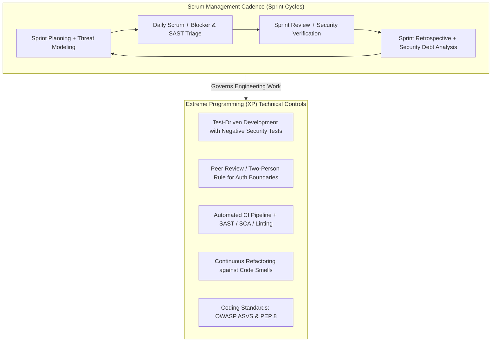

# Phase 1: Agile Process and Development Approach

**Project Name:** Secure Personal Expense Management Application (SPEMA)  
**Document Code:** SPEMA-SSDLC-PH01  
**Version:** 1.0.0  
**Date:** October 8, 2026  
**Security Classification:** Highly Confidential / Lab Examination Artifact  

---

## 1. Executive Summary & Project Context

The **Secure Personal Expense Management Application (SPEMA)** is an enterprise-grade financial management system designed for individual users to track income, record expenses, categorize transactions, view monthly summaries, filter transaction histories, and generate audited financial reports.

Because personal financial records represent sensitive private data, **confidentiality and strict multi-tenant authorization isolation** represent the core foundation of this project:
- **Primary Security Requirement:** A user must NEVER be able to access, modify, search, or report on another user's financial records.
- **Enforcement Principle:** Authorization must be enforced server-side at the service and data-access layer. The system must **never trust a `user_id` supplied by the client**, but instead extract and verify tenant identity exclusively from cryptographically signed session tokens.

To achieve both rapid development and uncompromising security assurance, Phase 1 establishes the software development methodology, Agile manifesto mappings, proactive refactoring patterns, and security risk mitigations.

---

## 2. Agile Process Selection & Justification

### 2.1 Selected Approach: Hybrid Secure Scrum with Extreme Programming (XP) Practices (Rugged Agile)

For this security-critical financial system, pure traditional Scrum lacks specific technical engineering safeguards, while pure Waterfall is too rigid to adapt to emerging vulnerability discoveries and incremental feedback. 

Therefore, the project adopts **Rugged Agile**, combining the iterative management framework of **Scrum** with the disciplined technical engineering practices of **Extreme Programming (XP)**, enhanced with the **OWASP Software Assurance Maturity Model (SAMM)** touchpoints.



### 2.2 Role Distribution in the Scrum Team

| Role | Responsibilities in SPEMA |
| :--- | :--- |
| **Security-Aware Product Owner (PO)** | Owns the Product Backlog, defines functional user stories, specifies regulatory/compliance requirements, and mandates that **no story is accepted without negative authorization tests**. |
| **Scrum Master / Security Champion (SM)** | Facilitates Agile ceremonies, removes delivery impediments, enforces the **Definition of Done (DoD)**, and acts as the gatekeeper against security debt. |
| **Cross-Functional Development Team** | Designs, implements, tests, containerizes, and deploys the application. Practices pair programming on sensitive security modules (Auth, RBAC/ABAC, reporting, encryption). |

### 2.3 Integrated XP Practices Justification

1. **Test-Driven Development (TDD) with Negative Security Test Cases:**
   - In financial applications, testing only the "happy path" (e.g., verifying User A can view User A's expense) leads to catastrophic security oversights.
   - XP's TDD practice requires writing **negative authorization tests** *before* implementing data access logic: a test asserting that `GET /api/v1/transactions/{id}` returns `HTTP 404/403` when requested with User B's token against User A's transaction ID.
2. **Continuous Integration (CI) with Automated Quality & Security Gates:**
   - Every commit triggers automated build, linting, SAST (Bandit), dependency vulnerability checks (pip-audit/Trivy), and full unit/integration test suites.
   - Builds break immediately if code smells or hardcoded secrets are detected.
3. **Continuous Refactoring:**
   - Security code smells (such as repetitive `user_id` query filtering or scattered validation logic) are aggressively refactored into centralized, unbypassable repository patterns and dependency injection interceptors.
4. **Pair Programming / Mandatory Peer Review on Trust Boundaries:**
   - All code modifying session handling, cryptographic hashing, database query construction, or CSV/PDF report generation must be reviewed or co-written under a two-person rule.
5. **Coding Standards & Collective Code Ownership:**
   - Strict compliance with OWASP Top 10 (2021), OWASP API Security Top 10 (2023), and PEP 8 conventions. All team members have authority and responsibility to patch security vulnerabilities anywhere in the codebase.

---

## 3. Mapping of Agile Manifesto Principles to SPEMA

| # | Agile Manifesto Principle | Application to Secure Expense Management System | Concrete Engineering Implementation |
| :-: | :--- | :--- | :--- |
| **1** | **Customer Satisfaction through Early and Continuous Delivery**<br>*"Our highest priority is to satisfy the customer through early and continuous delivery of valuable software."* | The user requires a trustworthy financial platform. Continuous delivery provides functional increments (Auth → Transaction Logging → Categorization → Reports) with guaranteed data isolation from Day 1. | Incremental releases via containerized builds where each sprint delivers an auditable, working micro-capability with verified multi-tenant protection. |
| **2** | **Welcoming Changing Requirements**<br>*"Welcome changing requirements, even late in development. Agile processes harness change for the customer's competitive advantage."* | Threat landscapes evolve (e.g., new JWT bypasses, regex denial of service, CSV injection vectors). The architecture welcomes changes in security standards without rewriting the business core. | Modular domain architecture: authorization policies, authentication providers, and report sanitizers are loosely coupled behind interfaces and dependency injection. |
| **3** | **Frequent Delivery of Working Software**<br>*"Deliver working software frequently, from a couple of weeks to a couple of months, with a preference to the shorter timescale."* | Instead of waiting months for a monolithic security audit, working software is produced in 2-week sprint increments, each deployable to Docker and Minikube. | Each sprint ends with an executable container image validated by automated integration and fuzzing suites, maintaining a deployable `main` branch. |
| **4** | **Daily Collaboration between Business and Developers**<br>*"Business people and developers must work together daily throughout the project."* | Security, business, and financial reporting goals must align. Daily collaboration ensures user stories capture precise financial constraints (e.g., currency precision, audit trail immutability). | Daily Scrum includes explicit verification of security acceptance criteria and prompt resolution of data model ambiguities. |
| **5** | **Continuous Attention to Technical Excellence and Good Design**<br>*"Continuous attention to technical excellence and good design enhances agility."* | Security cannot be bolted on at the end. Clean architectural boundaries, parameterized queries, and centralized authorization prevent bugs before they occur. | Enforced static analysis, strict type hinting (Python Pydantic v2), zero-trust tenant scoping in ORM repositories, and zero hardcoded secrets. |
| **6** | **Working Software as the Primary Measure of Progress**<br>*(Bonus Core Principle)* | A feature is not "working" if it exposes another user's financial balance or accepts unvalidated input. "Working" strictly means functionally complete AND provably secure. | Definition of Done (DoD) requires 100% passing unit tests, negative IDOR tests, zero high/critical SAST findings, and container security compliance. |

---

## 4. Proactive Refactoring Opportunities

Refactoring is a cornerstone XP practice. In secure software engineering, refactoring is primarily employed to **eliminate architectural security smells, eliminate anti-patterns, and centralize security controls**.

### 4.1 Refactoring Opportunity 1: Elimination of Broken Object-Level Authorization (BOLA / IDOR)

#### Problem Description & Security Smell
In an initial or naive implementation, endpoints accept an entity identifier (e.g., `transaction_id`) and trust either a client-supplied `user_id` or query the database solely by `transaction_id`. An attacker can manipulate the `transaction_id` parameter to view, modify, or delete financial records belonging to another user (Insecure Direct Object Reference - IDOR / CWE-639 / OWASP API1:2023).

#### Before Refactoring (Vulnerable Anti-Pattern)
```python
# VULNERABLE CODE (Anti-Pattern)
# Endpoint trusts client-supplied user_id and queries record without tenant scoping
@router.get("/transactions/{transaction_id}")
def get_transaction(transaction_id: int, user_id: int, db: Session = Depends(get_db)):
    # Flaw 1: Trusting user_id passed in query/body
    # Flaw 2: Direct lookup by PK without verifying ownership
    transaction = db.query(Transaction).filter(Transaction.id == transaction_id).first()
    if not transaction:
        raise HTTPException(status_code=404, detail="Transaction not found")
    
    # Flaw 3: Superficial or bypassable check, or check easily omitted
    return transaction
```

#### After Refactoring (Secure Enterprise Pattern)
The client-supplied `user_id` is completely removed from the request schema. Identity is extracted exclusively from the cryptographically verified JWT/session token via dependency injection (`get_current_active_user`). The database repository query enforces compound tenant scoping (`Transaction.id == transaction_id AND Transaction.user_id == current_user.id`).

```python
# SECURE REFACTORED CODE
# Identity derived strictly from authenticated session token; DB query enforces tenant scope
@router.get("/transactions/{transaction_id}", response_model=TransactionResponse)
def get_transaction(
    transaction_id: int = Path(..., ge=1, description="Unique transaction ID"),
    current_user: User = Depends(get_current_active_user),  # Server-derived identity
    db: Session = Depends(get_db)
):
    # Compound authorization filter at the data-access boundary
    transaction = db.query(Transaction).filter(
        Transaction.id == transaction_id,
        Transaction.user_id == current_user.id  # Strict tenant isolation
    ).first()
    
    if not transaction:
        # Generic 404 avoids leaking the existence of other users' records
        raise HTTPException(
            status_code=status.HTTP_404_NOT_FOUND, 
            detail="Transaction not found"
        )
    return transaction
```

#### Security & Maintainability Justification
1. **Zero-Trust Input:** Client cannot spoof identity because no `user_id` parameter exists.
2. **Data Leakage Prevention:** Returning `404 Not Found` rather than `403 Forbidden` prevents attackers from enumerating valid transaction IDs across the database.
3. **Compound Query Enforcement:** The database engine enforces row-level tenant boundary at the query execution level, preventing accidental data spills.

---

### 4.2 Refactoring Opportunity 2: Elimination of SQL Injection & CSV Formula Injection in Reporting

#### Problem Description & Security Smell
Transaction searching and report generation frequently suffer from two critical vulnerabilities:
1. **SQL Injection (CWE-89):** Constructing dynamic SQL queries via string formatting/concatenation to filter by date, category, or keyword.
2. **CSV Formula Injection / Spreadsheet Formula Injection (CWE-1236):** Generating downloadable CSV reports by writing raw user-supplied strings (such as transaction notes or descriptions like `=cmd|' /C calc'!A0` or `=SUM(1+1)`) into the spreadsheet without sanitization, leading to client-side code execution or confidential data exfiltration when opened by a user or accountant in Microsoft Excel or LibreOffice Calc.

#### Before Refactoring (Vulnerable Anti-Pattern)
```python
# VULNERABLE CODE (Anti-Pattern)
# Raw SQL query concatenation and unsanitized CSV export
@router.get("/reports/export-csv")
def export_report_vulnerable(keyword: str, user_id: int, db: Session = Depends(get_db)):
    # Vulnerability 1: SQL Injection via string formatting
    query = f"SELECT id, amount, category, description FROM transactions WHERE user_id = {user_id} AND description LIKE '%{keyword}%'"
    rows = db.execute(text(query)).fetchall()

    # Vulnerability 2: Raw CSV generation vulnerable to CSV Formula Injection
    csv_data = "ID,Amount,Category,Description\n"
    for r in rows:
        csv_data += f"{r.id},{r.amount},{r.category},{r.description}\n"
        
    return Response(content=csv_data, media_type="text/csv")
```

#### After Refactoring (Secure Enterprise Pattern)
1. Query logic is refactored into a strongly-typed ORM query builder using SQLAlchemy parameters and Pydantic schema validation.
2. The export engine is refactored into a dedicated `SecureCSVExporter` that strictly sanitizes any cell value starting with formula trigger symbols (`=`, `+`, `-`, `@`, `\t`, `\r`) by prepending a single quote (`'`), escaping existing quotes, and enforcing tenant scoping strictly via `current_user.id`.

```python
# SECURE REFACTORED CODE
import csv
import io
from fastapi.responses import StreamingResponse

FORMULA_PREFIXES = ('=', '+', '-', '@', '\t', '\r')

def sanitize_csv_cell(value: str) -> str:
    """Neutralize formula injection by prefixing triggering characters with single quote."""
    if not value:
        return ""
    str_val = str(value)
    if str_val.startswith(FORMULA_PREFIXES):
        return f"'{str_val}"
    return str_val

@router.get("/reports/export-csv")
def export_report_secure(
    keyword: Optional[str] = Query(None, max_length=100, regex=r"^[a-zA-Z0-9_\-\s]*$"),
    current_user: User = Depends(get_current_active_user),
    db: Session = Depends(get_db)
):
    # Parameterized ORM query builder with strict tenant scoping
    query = db.query(Transaction).filter(Transaction.user_id == current_user.id)
    if keyword:
        query = query.filter(Transaction.description.ilike(f"%{keyword}%"))
    
    records = query.order_by(Transaction.transaction_date.desc()).all()

    output = io.StringIO()
    writer = csv.writer(output, quoting=csv.QUOTE_ALL)
    writer.writerow(["Date", "Type", "Category", "Amount", "Description"])

    for item in records:
        writer.writerow([
            item.transaction_date.strftime("%Y-%m-%d"),
            sanitize_csv_cell(item.type),
            sanitize_csv_cell(item.category),
            f"{item.amount:.2f}",
            sanitize_csv_cell(item.description)
        ])

    output.seek(0)
    return StreamingResponse(
        iter([output.getvalue()]),
        media_type="text/csv",
        headers={"Content-Disposition": "attachment; filename=personal_expense_report.csv"}
    )
```

#### Security & Maintainability Justification
1. **Parameterized Execution:** SQL injection is completely impossible through ORM parameter bindings.
2. **Formula Neutralization:** Neutralizes CWE-1236, ensuring spreadsheet software treats text as literal strings.
3. **Streamed Output:** Avoids high memory overhead and potential Denial of Service (DoS) during report generation.

---

## 5. Agile Limitations and Risks for Security-Critical Systems & Mitigations

While Agile fosters rapid progress, financial systems require strict governance. The table below analyzes two principal risks of Agile in this domain and defines empirical mitigations.

| # | Agile Risk / Limitation | Root Cause & Security Impact | Formal Engineering Mitigation |
| :-: | :--- | :--- | :--- |
| **1** | **Velocity Bias & Security Debt Accumulation** *(Feature-First Trap)* | Scrum rewards story point completion. Developers are incentivized to build outward-facing features (dashboards, filters) while neglecting non-functional security controls (rate limiting, audit logs, credential rotation, session invalidation). This creates hidden **Security Debt** that leads to high vulnerability density. | **1. Security-Enhanced Definition of Done (DoD):** No story is marked "Done" unless it has passed automated unit/integration tests, zero high/critical SAST/SCA alerts, and negative authorization tests.<br>**2. Evil User Stories:** Explicit abuser stories (e.g., *"As an attacker, I want to tamper with transaction IDs to read another user's balance"*) are scheduled with explicit story points.<br>**3. Security Capacity Allocation:** 20% of every sprint's capacity is permanently reserved for security refactoring, hardening, and testing. |
| **2** | **Emergent Architecture Leading to Fragmented Trust Boundaries** *(Lack of Upfront Architecture)* | Agile's "emergent architecture" philosophy can lead to decentralized, inconsistent security checks scattered randomly across individual endpoints, creating exploitable authorization gaps and inconsistent logging. | **1. Sprint 0 Architectural Threat Modeling:** An initial STRIDE and Trust Boundary analysis is conducted before feature development to define global, unbypassable security invariants.<br>**2. Centralized Security Middleware:** All security controls (token verification, tenancy scoping, security headers, rate limiting) are enforced centrally via FastAPI dependencies and middleware rather than left to developer discretion in individual routes.<br>**3. Triggered Re-threat Modeling:** Any story modifying data schemas, external interfaces, or privileges triggers a mandatory threat model delta review. |

---

## 6. Phase Traceability & Hand-Off Summary

### 6.1 Artifacts Produced
1. Formal Agile development framework selection (**Rugged Scrum + XP**).
2. Complete mapping of 6 Agile Manifesto principles to the Secure Expense Management Application.
3. Two deep refactoring opportunities with full **Before vs. After** source code and security justifications (Eliminating BOLA/IDOR and eliminating SQLi + CSV Formula Injection).
4. Identification of two core Agile limitations for security-critical financial systems along with concrete, verifiable engineering mitigations.
5. Project structure initialization, Git repository creation, and security-hardened `.gitignore`.

### 6.2 Storage Location
- Main Document: `docs/phase01_agile_process/phase01_agile_approach.md`
- Repository Root: `C:\Users\anand\OneDrive\Documents\SSDLC\endsem_lab`

### 6.3 Dependencies on Previous Phases
- *None* (Phase 1 is the baseline foundational phase derived from the laboratory problem statement).

### 6.4 Forward Dependencies for Later Phases
- **Phase 2 (Requirements Engineering):** Will translate the security invariants and Agile roles defined here into prioritized Functional, Non-Functional, and Security Requirements.
- **Phase 9 & 10 (Product Backlog & Sprint Execution):** Will adopt the Scrum structure, Definition of Done, velocity capacity allocations, and user/evil stories established here.
- **Phase 11 & 12 (Secure Build & Refactoring):** Will physically implement and verify the refactored code patterns and TDD negative authorization suites.

### 6.5 Consistency & Security Sanity Check
- [x] **Primary Security Rule Checked:** The refactored authorization pattern explicitly verifies that `user_id` is never accepted from client inputs and is derived solely from the server-validated session/token.
- [x] **Architecture Consistency:** No complex or extraneous frameworks introduced; clean Python/FastAPI/SQLAlchemy architecture chosen.
- [x] **Traceability Maintained:** All items directly trace to the examination problem statement.
