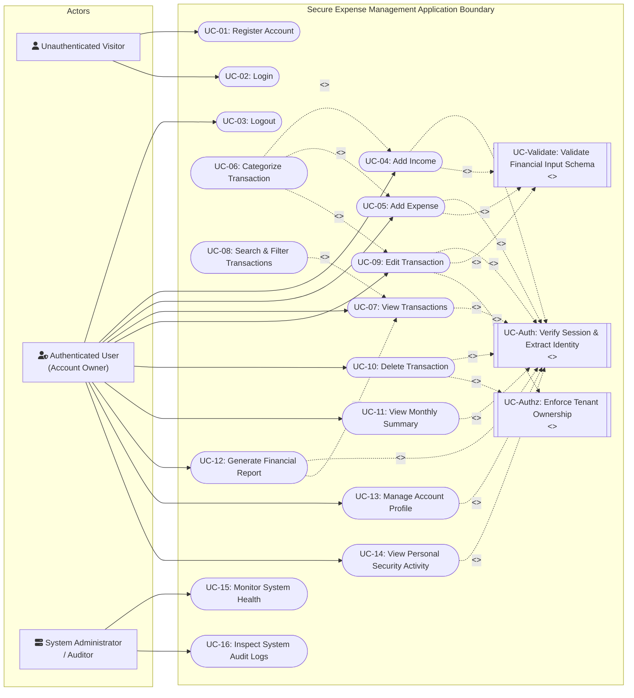
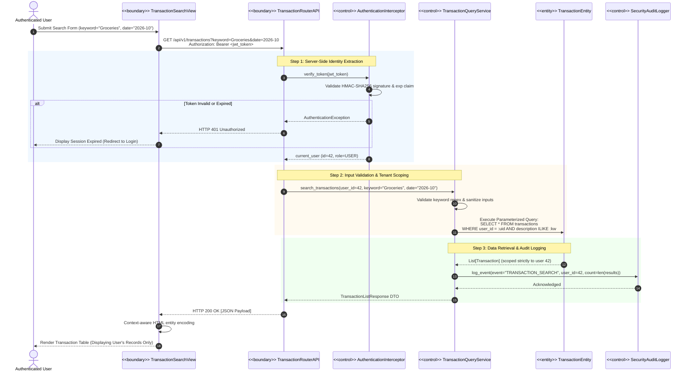

# Phase 3: Requirements Analysis and UML

**Project Title:** Secure Personal Expense Management Application (SPEMA)  
**Document ID:** SPEMA-DOC-PH03  
**Course Code:** 24CYS401 – Secure Software Engineering Laboratory  
**Document Path:** `docs/phases/phase-03-uml.md`  
**Classification:** Laboratory Examination Artifact – High Integrity  
**Status:** Approved Baseline  

---

## 1. Executive Summary & Upstream Traceability

This document establishes the formal **Requirements Analysis and UML Use Case Modeling** for the Secure Personal Expense Management Application (SPEMA), deriving directly from the approved Phase 1 Rugged Agile approach (`docs/phases/phase-01-agile.md`) and Phase 2 Requirements Engineering specifications (`docs/phases/phase-02-requirements.md` / `docs/requirements/requirements.yaml`).

### The Primary Security Invariant
> **An authenticated user must not be able to access, modify, search, aggregate, or report on another user's financial records.**
> 
> In this UML analysis phase, this invariant is architecturally enforced across all interaction paths:
> 1. Every financial transaction use case incorporates a mandatory server-side identity verification step.
> 2. The boundary between the untrusted browser and server-side execution environment completely rejects client-supplied user identifiers.
> 3. Control entities enforce compound tenant scoping (`user_id == authenticated_token.user_id`) at the data access boundary.

---

## 2. UML Use Case Model

### 2.1 Actor Taxonomy (Justified Actors Only)

Only actors with distinct security perimeters and operational authorities are included:

1. **Unauthenticated Visitor (Guest):**  
   An untrusted external actor interacting through a web browser. Has access exclusively to public onboarding endpoints (Registration, Login). Strictly barred from any financial data or transaction processing.
2. **Authenticated Account Owner (User):**  
   A verified identity holding a cryptographically signed JWT session token. Can perform CRUD operations, view summaries, execute searches, and download reports **strictly restricted to their own account partition**.
3. **System Administrator / Auditor (Ops Role):**  
   An operational role responsible for container health probes (`/healthz`, `/readyz`) and auditing infrastructure. Under the **Zero-Trust Data Isolation** policy, the Administrator is barred from viewing, modifying, or querying individual users' financial transaction data.

---

### 2.2 Visual Use Case Diagram



---

### 2.3 Use Case Inventory & Phase 2 Traceability

| UC ID | Use Case Name | Primary Actor | Associated Requirements | Relationship Description |
| :---: | :--- | :--- | :--- | :--- |
| **UC-01** | **Register Account** | Visitor | `FR-001`, `SEC-001`, `SEC-002`, `SEC-015` | Onboarding unauthenticated visitor with strong password hashing. |
| **UC-02** | **Login** | Visitor | `FR-002`, `SEC-001`, `SEC-003`, `SEC-004` | Credential verification, rate limiting, and JWT issuance. |
| **UC-03** | **Logout** | User | `FR-003`, `SEC-004`, `SEC-015` | Session termination and token invalidation. |
| **UC-Auth** | **Verify Session & Extract Identity** | System | `SEC-004`, `SEC-005`, `SEC-007` | **<<include>>** by all protected use cases; cryptographically extracts `user_id`. |
| **UC-Validate** | **Validate Financial Input Schema** | System | `SEC-008`, `NFR-003` | **<<include>>** by transaction mutation use cases; positive decimal checks. |
| **UC-Authz** | **Enforce Tenant Ownership** | System | `SEC-005`, `SEC-006` | **<<include>>** by Edit/Delete; ensures object ID belongs to token caller. |
| **UC-04** | **Add Income** | User | `FR-004`, `SEC-005`, `SEC-008`, `SEC-009` | Persists income record strictly bound to caller tenancy. |
| **UC-05** | **Add Expense** | User | `FR-005`, `SEC-005`, `SEC-008`, `SEC-009` | Persists expense record strictly bound to caller tenancy. |
| **UC-06** | **Categorize Transaction** | User | `FR-006`, `SEC-008` | **<<extend>>** Add/Edit transactions with predefined or custom tags. |
| **UC-07** | **View Transactions** | User | `FR-008`, `SEC-005`, `SEC-017` | Retrieves paginated transaction history scoped to `current_user.id`. |
| **UC-08** | **Search & Filter Transactions** | User | `FR-008`, `SEC-005`, `SEC-009` | **<<extend>>** View Transactions with multi-parameter criteria. |
| **UC-09** | **Edit Transaction** | User | `FR-009`, `SEC-005`, `SEC-006`, `SEC-008` | Updates existing record; returns 404 if record belongs to another user. |
| **UC-10** | **Delete Transaction** | User | `FR-009`, `SEC-005`, `SEC-006`, `SEC-015` | Removes record; returns 404 if record belongs to another user. |
| **UC-11** | **View Monthly Summary** | User | `FR-007`, `SEC-005`, `NFR-003` | Aggregates income, expenses, and net balance solely for caller. |
| **UC-12** | **Generate Financial Report** | User | `FR-010`, `SEC-005`, `SEC-011`, `SEC-012` | **<<extend>>** View Transactions; exports formula-sanitized CSV. |
| **UC-13** | **Manage Account Profile** | User | `FR-011`, `SEC-001`, `SEC-002` | Profile view and verified password rotation. |
| **UC-14** | **View Personal Security Activity**| User | `SEC-015`, `SEC-016` | User views their own recent logins and security events. |
| **UC-15** | **Monitor System Health** | Admin | `FR-012`, `NFR-002` | Unauthenticated Kubernetes liveness/readiness inspection. |
| **UC-16** | **Inspect System Audit Logs** | Admin | `SEC-015`, `SEC-016` | Admin reviews aggregated operational/security logs (zero transaction PII).|

---

### 2.4 Justification of `<<include>>` and `<<extend>>` Relationships

1. **`<<include>> UC-Auth (Verify Session & Extract Identity)`:**  
   Every transaction, summary, profile, and reporting operation *unconditionally requires* identity validation. Modeling this as an `<<include>>` ensures that authorization is an architectural invariant rather than an optional controller check.
2. **`<<include>> UC-Validate (Validate Financial Input Schema)`:**  
   Creating or modifying a transaction unconditionally requires schema validation (e.g. positive decimals, ISO date formats, string length constraints).
3. **`<<include>> UC-Authz (Enforce Tenant Ownership)`:**  
   When modifying or deleting an individual entity by its primary key, the system unconditionally executes an ownership verification query before performing mutations.
4. **`<<extend>> UC-Categorize Transaction`:**  
   Adding or editing a transaction can proceed with a default category, or the user can optionally extend the transaction creation by defining or attaching a specialized custom category.
5. **`<<extend>> UC-Search & Filter` and `UC-Generate Financial Report`:**  
   Viewing transactions is the base activity. Searching extends the viewing flow by injecting filter predicates. Generating a report extends the flow by serializing the filtered dataset into a sanitized downloadable file.

---

## 3. Detailed Critical Use-Case Specifications

### 3.1 Specification 1: Add Transaction (Income / Expense)

| Field | Description |
| :--- | :--- |
| **Use Case ID** | **UC-TXN-01** |
| **Use Case Name** | **Add Transaction (Income or Expense)** |
| **Goal** | Allow an authenticated user to record an income or expense transaction strictly bound to their own tenancy partition. |
| **Primary Actor** | Authenticated Account Owner (User) |
| **Preconditions** | 1. User holds a valid, unexpired cryptographically signed JWT access token (`SEC-004`).<br>2. Database connectivity is active. |
| **Trigger** | User submits the transaction form or an API client posts payload to `POST /api/v1/transactions`. |
| **Main Success Flow** | 1. Client sends HTTP POST request to `/api/v1/transactions` with JSON payload (`amount`, `type`, `category`, `transaction_date`, `description`) and header `Authorization: Bearer <token>`.<br>2. System executes `UC-Auth`: verifies JWT signature, issuer, and expiration time (`SEC-004`).<br>3. System extracts `user_id` from the verified token claims (`sub`). Any client-provided `user_id` in headers, query parameters, or body is discarded (`SEC-005`, `SEC-007`).<br>4. System executes `UC-Validate`: validates that `amount` is a positive decimal > 0.00, `type` is either `INCOME` or `EXPENSE`, `category` is non-empty, and `description` is <= 255 characters (`SEC-008`).<br>5. System instantiates a `Transaction` entity, binding `Transaction.user_id = token.user_id`.<br>6. System commits the entity using parameterized ORM within an ACID database transaction (`SEC-009`, `NFR-003`).<br>7. System emits an audit log event `TRANSACTION_CREATED` recording timestamp, caller `user_id`, transaction ID, and client IP (`SEC-015`).<br>8. System returns `HTTP 201 Created` with the serialized transaction data. |
| **Alternative Flows** | **4a. Custom Category Assignment (`<<extend>> UC-06`):**<br>- User specifies a new custom category name.<br>- System verifies that the category name adheres to regex `^[a-zA-Z0-9_\-\s]{1,50}$`.<br>- System binds the category to the user's custom category list and proceeds to Step 5. |
| **Exception Flows** | **2a. Token Missing, Expired, or Forged:**<br>- System rejects request immediately with `HTTP 401 Unauthorized` and `WWW-Authenticate: Bearer error="invalid_token"`. Workflow aborts.<br>**4b. Invalid Financial Input:**<br>- Amount is negative, zero, or malformed; date is invalid; or description exceeds 255 chars.<br>- System rejects request with `HTTP 422 Unprocessable Entity` containing field-level validation errors. Database is untouched.<br>**6a. Database Persistence Fault:**<br>- System catches database exception, rolls back transaction, logs internal error reference, and returns generic `HTTP 500 Internal Server Error` without leaking stack trace (`SEC-018`). |
| **Security Checks** | 1. Bearer token signature validation (HMAC-SHA256).<br>2. Rejection of unauthenticated callers.<br>3. Whitelist input validation and decimal range enforcement.<br>4. Server-side identity extraction (zero client trust).<br>5. Parameterized SQL query execution.<br>6. Audit log generation with credential masking. |
| **Postconditions** | 1. A new transaction record is persisted in the database with `user_id` strictly matching the authenticated user.<br>2. The transaction is instantly queryable by the owner and completely invisible to all other users.<br>3. Audit log records the event. |
| **Security Invariants** | 1. `Transaction.user_id == current_user.id` is permanently assigned and immutable.<br>2. Under no circumstance can a user inject a transaction into another user's partition. |

---

### 3.2 Specification 2: Generate Financial Report

| Field | Description |
| :--- | :--- |
| **Use Case ID** | **UC-REP-01** |
| **Use Case Name** | **Generate Financial Report (CSV Export)** |
| **Goal** | Export the authenticated user's transactions into a sanitized, tamper-resistant downloadable CSV report without disclosing any other user's records. |
| **Primary Actor** | Authenticated Account Owner (User) |
| **Preconditions** | 1. User holds a valid, unexpired JWT token.<br>2. User possesses zero or more transactions in the system. |
| **Trigger** | User clicks "Export CSV" on the dashboard or sends `GET /api/v1/reports/export-csv` with optional filter parameters. |
| **Main Success Flow** | 1. Client sends HTTP GET request to `/api/v1/reports/export-csv` with optional query parameters (`start_date`, `end_date`, `category`, `type`) and header `Authorization: Bearer <token>`.<br>2. System executes `UC-Auth`: verifies JWT signature and extracts `current_user.id` from token subject claim (`SEC-004`, `SEC-005`). Any client-supplied `user_id` parameter is strictly disregarded (`SEC-007`).<br>3. System validates query parameters: dates adhere to `YYYY-MM-DD` format; category strings conform to allowed charset (`SEC-008`).<br>4. System constructs a parameterized ORM query with mandatory tenancy filter: `WHERE user_id = :current_user.id AND ...` (`SEC-005`, `SEC-009`, `SEC-012`).<br>5. System retrieves the matching transaction records belonging solely to the authenticated user.<br>6. System initializes `SecureCSVExporter`. For every data row, all string values (`description`, `category`, `type`) are checked against formula triggers (`=`, `+`, `-`, `@`, `\t`, `\r`). If triggered, prepend `'` (`SEC-011`).<br>7. System constructs an RFC-4180 compliant CSV stream with header `Content-Disposition: attachment; filename="expense_report_<YYYYMMDD>.csv"`.<br>8. System emits an audit log event `REPORT_EXPORTED` recording caller `user_id`, exported record count, query parameters, and timestamp (`SEC-015`).<br>9. System streams the CSV response to the client with `Content-Type: text/csv`. |
| **Alternative Flows** | **5a. No Transactions Match Filter:**<br>- System generates a CSV file containing standard column headers (`Date,Type,Category,Amount,Description`) with zero data rows.<br>- Flow proceeds to Step 8. |
| **Exception Flows** | **2a. Unauthenticated or Expired Token:**<br>- System returns `HTTP 401 Unauthorized`. Workflow aborts.<br>**3a. Invalid Filter Parameter:**<br>- Query parameter fails validation (e.g. invalid date syntax or string exceeding length limit).<br>- System returns `HTTP 400 Bad Request` with error explanation (`SEC-008`).<br>**4a. Attempted Cross-Tenant Parameter Injection:**<br>- Client passes `?user_id=999`. The server-side query builder discards the client parameter and binds strictly to `current_user.id`. Only caller records are exported (`SEC-007`). |
| **Security Checks** | 1. Cryptographic token verification.<br>2. Complete rejection of client-supplied tenancy overrides.<br>3. Mandatory compound tenant query filter at data-access layer.<br>4. Spreadsheet Formula Injection (CWE-1236) neutralization across all export fields.<br>5. Streamed data transmission to prevent memory exhaustion DoS (`SEC-017`).<br>6. Audit logging of data exfiltration event. |
| **Postconditions** | 1. User downloads a CSV report containing exclusively their own financial records.<br>2. No server-side ledger state is mutated.<br>3. Security audit log records the export event. |
| **Security Invariants** | 1. Under no circumstance does the generated report contain any row where `Transaction.user_id != authenticated_user.id`.<br>2. No cell beginning with formula trigger symbols (`=`, `+`, `-`, `@`) is output without the neutralizing apostrophe prefix. |

---

## 4. Scenario-Based Analysis Model (BCE Architecture)

### 4.1 Scenario
> **"Authenticated user searches and views their transactions"**

### 4.2 Analysis Elements (Boundary, Control, Entity - BCE)

| Analysis Category | Class / Component Name | Stereotype | Architectural Responsibility |
| :--- | :--- | :---: | :--- |
| **Actor** | `Authenticated User (Account Owner)` | Actor | Initiates search by providing search query parameters and presenting session token. |
| **Boundary** | `TransactionSearchView` | `<<boundary>>` | Web client UI rendering search filters, input fields, and tabular results. Context-aware HTML encoding of results (`SEC-010`). |
| **Boundary** | `TransactionRouterAPI` | `<<boundary>>` | REST API endpoint (`GET /api/v1/transactions`). Handles HTTP request parsing, header validation, and response serialization. |
| **Control** | `AuthenticationInterceptor` | `<<control>>` | Intercepts HTTP request, verifies JWT signature and expiration, extracts user claims, and injects `current_user` into service context (`SEC-004`). |
| **Control** | `TransactionQueryService` | `<<control>>` | Validates query criteria (regex, date ranges), binds `current_user.id` as the mandatory root tenancy filter, and coordinates data access (`SEC-005`, `SEC-008`). |
| **Control** | `SecurityAuditLogger` | `<<control>>` | Emits structured JSON audit events recording query execution, record counts, and caller identity (`SEC-015`). |
| **Entity** | `UserSessionToken` | `<<entity>>` | Cryptographic session state containing subject claim (`sub`), expiry (`exp`), and signature. |
| **Entity** | `TransactionEntity` | `<<entity>>` | Relational database entity representing financial records (`id`, `user_id`, `amount`, `type`, `category`, `date`, `description`). |
| **Entity** | `AuditLogEntry` | `<<entity>>` | Immutable security log record documenting search and access events. |

---

### 4.3 Robustness Diagram (BCE Analysis Model)

```mermaid
flowchart TD
    subgraph Untrusted_Client_Perimeter ["Untrusted Client Boundary"]
        User(["fa:fa-user Authenticated User\n(Account Owner)"])
        UI["<<boundary>>\nTransactionSearchView\n(Web Browser)"]
    end

    subgraph API_Gateway_Perimeter ["Server Boundary & Controls"]
        API["<<boundary>>\nTransactionRouterAPI\n(/api/v1/transactions)"]
        AuthCtrl["<<control>>\nAuthenticationInterceptor\n(Token Verification)"]
        QueryCtrl["<<control>>\nTransactionQueryService\n(Tenancy Scoping & Query Builder)"]
        AuditCtrl["<<control>>\nSecurityAuditLogger\n(Audit Recorder)"]
    end

    subgraph Trusted_Data_Perimeter ["Trusted Data Entity Boundary"]
        TokenEnt[("<<entity>>\nUserSessionToken\n(Cryptographic Token)")]
        TxnEnt[("<<entity>>\nTransactionEntity\n(Database Table)")]
        LogEnt[("<<entity>>\nAuditLogEntry\n(Audit Store)")]
    end

    %% Interactions
    User -->|1. Enters search criteria| UI
    UI -->|2. HTTPS GET with Bearer Token| API
    API -->|3. Validate Token| AuthCtrl
    AuthCtrl -->|4. Verify Signature & Expiry| TokenEnt
    TokenEnt -.->|5. Token Valid (user_id = U101)| AuthCtrl
    AuthCtrl -->|6. Injects current_user| API
    API -->|7. Execute search(criteria, U101)| QueryCtrl
    QueryCtrl -->|8. Parameterized Query\nWHERE user_id = :U101 AND ...| TxnEnt
    TxnEnt -.->|9. Returns Scoped Transactions| QueryCtrl
    QueryCtrl -->|10. Record Search Event| AuditCtrl
    AuditCtrl -->|11. Append Audit Entry| LogEnt
    QueryCtrl -->|12. Return DTO List| API
    API -->|13. HTTP 200 JSON Payload| UI
    UI -->|14. Render Encoded Results| User
```

---

### 4.4 Scenario Collaboration & Control Sequence Flow



---

## 5. Consistency & Security Sanity Check against Phase 2 Requirements

| Phase 2 Requirement ID | Description | How Addressed in Phase 3 UML Models | Status |
| :---: | :--- | :--- | :---: |
| **`FR-001` - `FR-003`** | Registration, Login, Logout | Mapped to `UC-01`, `UC-02`, and `UC-03`. | **Consistent** |
| **`FR-004` - `FR-006`** | Income, Expense, Categorization | Mapped to `UC-04`, `UC-05`, and `<<extend>> UC-06`; detailed in `UC-TXN-01`. | **Consistent** |
| **`FR-007` - `FR-008`** | Monthly Summary, Search/Filter | Mapped to `UC-11`, `UC-07`, and `UC-08`; modeled in BCE Scenario Analysis. | **Consistent** |
| **`FR-009`** | Transaction Mutation / Deletion | Mapped to `UC-09` and `UC-10`, including mandatory `UC-Authz` ownership checks. | **Consistent** |
| **`FR-010`** | Financial Report Export | Mapped to `UC-12`; detailed in `UC-REP-01` specification. | **Consistent** |
| **`SEC-004`** | Session Token Security | Encapsulated in `UC-Auth` and `AuthenticationInterceptor` control class. | **Consistent** |
| **`SEC-005`** | Server-Side Multi-Tenant Isolation | Explicitly enforced in `UC-Auth`, `UC-Authz`, `UC-TXN-01`, `UC-REP-01`, and BCE Model. | **Consistent** |
| **`SEC-006`** | Anti-Enumeration 404 Response | Specified in `UC-Authz` exception flows (uniform 404 on cross-tenant access). | **Consistent** |
| **`SEC-007`** | Parameter Pollution Defense | Handled in Step 3 of `UC-TXN-01` and Step 2 of `UC-REP-01` (client IDs discarded). | **Consistent** |
| **`SEC-008`** | Whitelist Schema Validation | Encapsulated in `UC-Validate` and Step 4 of `UC-TXN-01`. | **Consistent** |
| **`SEC-009`** | Parameterized SQL Queries | Specified in BCE `TransactionQueryService` interaction with `TransactionEntity`. | **Consistent** |
| **`SEC-011`** | CSV Formula Injection Neutralization | Explicitly detailed in Step 6 of `UC-REP-01` (`SecureCSVExporter`). | **Consistent** |
| **`SEC-015`** | Audit Event Logging | Modeled in `UC-14`, `UC-16`, and BCE `SecurityAuditLogger`. | **Consistent** |

---

## 6. Phase 3 Laboratory Artifact Summary

### 6.1 Artifacts Created & Stored
1. **Primary Laboratory Documentation:**  
   [`docs/phases/phase-03-uml.md`](file:///C:/Users/anand/OneDrive/Documents/SSDLC/endsem_lab/docs/phases/phase-03-uml.md)
2. **PlantUML Source Files:**  
   - Use Case Diagram: [`docs/uml/use_case_diagram.puml`](file:///C:/Users/anand/OneDrive/Documents/SSDLC/endsem_lab/docs/uml/use_case_diagram.puml)
   - BCE Robustness Scenario Analysis: [`docs/uml/analysis_model_robustness.puml`](file:///C:/Users/anand/OneDrive/Documents/SSDLC/endsem_lab/docs/uml/analysis_model_robustness.puml)
3. **StarUML Editable Project Model:**  
   - StarUML Model File: [`docs/uml/spema_model.mdj`](file:///C:/Users/anand/OneDrive/Documents/SSDLC/endsem_lab/docs/uml/spema_model.mdj)

### 6.2 Upstream Dependencies
- Consumes Phase 1 Rugged Agile engineering practices (`docs/phases/phase-01-agile.md`).
- Consumes Phase 2 Requirements Engineering specifications (`docs/phases/phase-02-requirements.md` / `docs/requirements/requirements.yaml`).

### 6.3 Downstream Hand-Off
- **Phase 4 (Data and Information Flow Modeling):** Will use the entities (`TransactionEntity`, `UserSessionToken`, `AuditLogEntry`) and use case flows to construct the ER diagram and DFD Level 0/1 with trust boundaries.
- **Phase 5 (Architecture & Design):** Will refine the BCE boundaries and controls into concrete component interfaces and architectural design patterns.
- **Phase 7 & 8 (Threat Modeling & Attack Tree):** Will analyze the trust boundaries identified between UI, API, Service Controls, and Data Entities.
- **Phase 9 & 10 (Product Backlog & Scrum):** Will decompose the use cases into sprint user stories and acceptance criteria.
