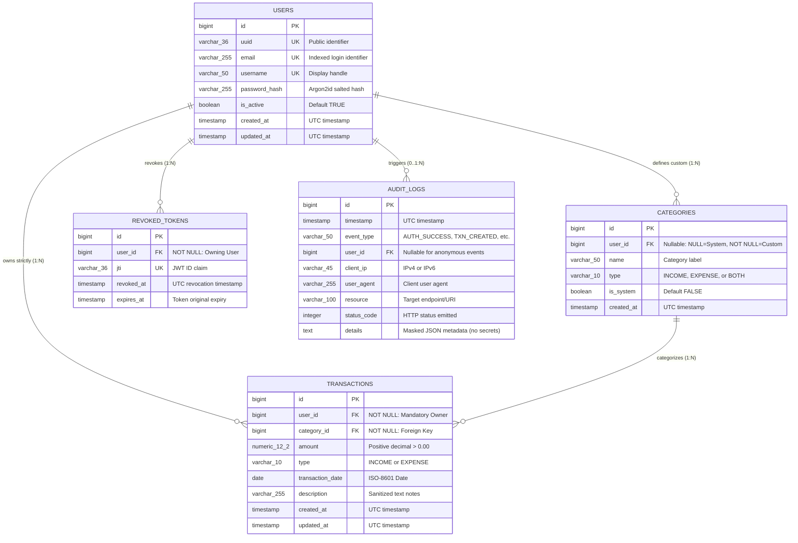

# Phase 4: Data and Information Flow Modeling

**Project Title:** Secure Personal Expense Management Application (SPEMA)  
**Document ID:** SPEMA-DOC-PH04  
**Course Code:** 24CYS401 – Secure Software Engineering Laboratory  
**Document Path:** `docs/phases/phase-04-data-flow.md`  
**Classification:** Laboratory Examination Artifact – High Integrity  
**Status:** Approved Baseline  

---

## 1. Executive Summary & Traceability Baseline

Building directly upon the approved Phase 1 Rugged Agile engineering model (`docs/phases/phase-01-agile.md`), Phase 2 Requirements Engineering specifications (`docs/phases/phase-02-requirements.md`), and Phase 3 UML Analysis models (`docs/phases/phase-03-uml.md`), Phase 4 establishes:
1. **PART A — Relational Entity-Relationship (ER) Model:** Complete relational schema, field definitions, foreign keys, constraints, and compound indexes designed for unbypassable single-tenant isolation.
2. **PART B — Data Flow Diagrams (DFD) & Information Flow Modeling:** Level-0, Level-1, and Level-2 DFDs, delineating data stores, sensitive data flows, and realistic trust boundaries.

### The Primary Security Invariant in Data & Flow Modeling
> **A Transaction must be associated with exactly one authorized owner/user.**
> 
> Application authorization cannot accidentally become ambiguous. The database schema physically enforces ownership via `NOT NULL` foreign keys, and all performance indexes are anchored to `user_id`. In the DFDs, authorization is modeled as a centralized, non-bypassable server-side gate that extracts identity from cryptographic token claims, completely discarding any client-provided identifiers.

---

## 2. PART A — Relational Data Model (ER Model)

### 2.1 Entity Catalog & Justification

To provide complete functionality without unnecessary over-normalization, the schema defines five core entities:

1. **`User` (`users` table):** Master identity table storing authentication credentials, account state, and registration metadata.
2. **`Category` (`categories` table):** Financial transaction categories. Models both global system categories (`user_id IS NULL`) and tenant-specific custom categories (`user_id = :id`).
3. **`Transaction` (`transactions` table):** Central financial ledger entity. Associates every financial entry (income or expense) strictly with a single owning user.
4. **`AuditLog` (`audit_logs` table):** Append-only security event ledger capturing authentication events, authorization rejections, mutations, and report exports (`SEC-015`).
5. **`RevokedToken` (`revoked_tokens` table):** Session invalidation store recording revoked JWT identifiers (`jti`) upon logout, providing stateless JWT architectures with immediate revocation capabilities (`FR-003`, `SEC-004`).

---

### 2.2 Visual Entity-Relationship Diagram



---

### 2.3 Comprehensive Schema Specifications

#### 2.3.1 Entity: `users`
- **Purpose:** Stores account credentials and identity status.
- **Attributes:**
  - `id`: `BIGINT`, Primary Key, Auto-increment. Internal database key; never exposed in public client URLs.
  - `uuid`: `VARCHAR(36)`, Not Null, Unique constraint. Publicly referenceable UUIDv4.
  - `email`: `VARCHAR(255)`, Not Null, Unique constraint, Case-insensitive unique index.
  - `username`: `VARCHAR(50)`, Not Null, Unique constraint. Alphanumeric handle.
  - `password_hash`: `VARCHAR(255)`, Not Null. Argon2id cryptographic hash string (`SEC-001`).
  - `is_active`: `BOOLEAN`, Not Null, Default `TRUE`. Enables administrative suspension.
  - `created_at`: `TIMESTAMP WITH TIME ZONE`, Not Null, Default `CURRENT_TIMESTAMP`.
  - `updated_at`: `TIMESTAMP WITH TIME ZONE`, Not Null, Default `CURRENT_TIMESTAMP`.
- **Integrity Constraints:**
  - `CHECK (length(username) >= 3 AND length(username) <= 50)`
  - `CHECK (email LIKE '%_@__%.__%')`

#### 2.3.2 Entity: `categories`
- **Purpose:** Organizes income and expenditure streams.
- **Attributes:**
  - `id`: `BIGINT`, Primary Key, Auto-increment.
  - `user_id`: `BIGINT`, Nullable, Foreign Key referencing `users(id)` ON DELETE CASCADE.  
    *Ownership Rule:* If `user_id IS NULL`, the category is a system-wide default (e.g. "Salary", "Food & Dining"). If `user_id IS NOT NULL`, it is a private category visible and usable **strictly** by that user.
  - `name`: `VARCHAR(50)`, Not Null.
  - `type`: `VARCHAR(10)`, Not Null. `CHECK (type IN ('INCOME', 'EXPENSE', 'BOTH'))`.
  - `is_system`: `BOOLEAN`, Not Null, Default `FALSE`.
  - `created_at`: `TIMESTAMP WITH TIME ZONE`, Not Null, Default `CURRENT_TIMESTAMP`.
- **Integrity Constraints:**
  - `UNIQUE (user_id, name)`: Prevents duplicate category names per user.

#### 2.3.3 Entity: `transactions`
- **Purpose:** The core financial ledger recording every income and expense entry.
- **Attributes:**
  - `id`: `BIGINT`, Primary Key, Auto-increment.
  - `user_id`: `BIGINT`, **NOT NULL**, Foreign Key referencing `users(id)` ON DELETE CASCADE.  
    *Ownership Rule:* Enforces that every single transaction is bound to exactly one authorized owner.
  - `category_id`: `BIGINT`, Not Null, Foreign Key referencing `categories(id)` ON DELETE RESTRICT.
  - `amount`: `NUMERIC(12, 2)`, Not Null. Fixed-point decimal arithmetic (`NFR-003`).  
    `CHECK (amount > 0.00 AND amount <= 1000000.00)`.
  - `type`: `VARCHAR(10)`, Not Null. `CHECK (type IN ('INCOME', 'EXPENSE'))`.
  - `transaction_date`: `DATE`, Not Null. ISO-8601 date of transaction occurrence.
  - `description`: `VARCHAR(255)`, Nullable. Sanitized textual note (`SEC-008`).
  - `created_at`: `TIMESTAMP WITH TIME ZONE`, Not Null, Default `CURRENT_TIMESTAMP`.
  - `updated_at`: `TIMESTAMP WITH TIME ZONE`, Not Null, Default `CURRENT_TIMESTAMP`.
- **Integrity Constraints:**
  - `CHECK (amount > 0.00)`: Strictly positive financial amounts. Negative numbers are blocked at the database engine level.

#### 2.3.4 Entity: `revoked_tokens`
- **Purpose:** Supports cryptographic logout (`FR-003`, `SEC-004`) and immediate token revocation in stateless JWT architectures.
- **Attributes:**
  - `id`: `BIGINT`, Primary Key, Auto-increment.
  - `user_id`: `BIGINT`, Not Null, Foreign Key referencing `users(id)` ON DELETE CASCADE.
  - `jti`: `VARCHAR(36)`, Not Null, Unique constraint. Unique JWT ID claim.
  - `revoked_at`: `TIMESTAMP WITH TIME ZONE`, Not Null, Default `CURRENT_TIMESTAMP`.
  - `expires_at`: `TIMESTAMP WITH TIME ZONE`, Not Null. Expiration boundary of the revoked token.

#### 2.3.5 Entity: `audit_logs`
- **Purpose:** Tamper-resistant audit recording of all security-sensitive operations (`SEC-015`).
- **Attributes:**
  - `id`: `BIGINT`, Primary Key, Auto-increment.
  - `timestamp`: `TIMESTAMP WITH TIME ZONE`, Not Null, Default `CURRENT_TIMESTAMP`.
  - `event_type`: `VARCHAR(50)`, Not Null. E.g. `AUTH_SUCCESS`, `AUTH_FAILURE`, `AUTHZ_DENIED`, `TXN_CREATED`, `TXN_UPDATED`, `TXN_DELETED`, `REPORT_EXPORTED`.
  - `user_id`: `BIGINT`, Nullable, Foreign Key referencing `users(id)` ON DELETE SET NULL.
  - `client_ip`: `VARCHAR(45)`, Not Null. IPv4 or IPv6 address.
  - `user_agent`: `VARCHAR(255)`, Nullable.
  - `resource`: `VARCHAR(100)`, Not Null. Request path or resource accessed.
  - `status_code`: `INTEGER`, Not Null. HTTP response code emitted.
  - `details`: `TEXT`, Nullable. Sanitized JSON string with **all sensitive credentials masked** (`SEC-016`).

---

### 2.4 Indexing Strategy for Tenancy Isolation and Query Performance

In a multi-tenant application, index design is a critical security and performance control. If queries do not leverage an index anchored to the tenant key, database performance degrades into full-table scans, increasing denial-of-service vulnerability (`SEC-017`).

Every critical transaction index is **compound and begins with `user_id`**:

| Index Name | Target Table | Indexed Columns | Justification & Query Optimization |
| :--- | :--- | :--- | :--- |
| **`idx_txn_user_date`** | `transactions` | `(user_id, transaction_date DESC)` | Optimizes monthly financial summaries (`FR-007`) and date-range transaction history queries while strictly partitioning rows by tenant. |
| **`idx_txn_user_type_date`**| `transactions` | `(user_id, type, transaction_date DESC)` | Accelerates income vs expense aggregations and cash flow calculations within the tenant boundary. |
| **`idx_txn_user_cat`** | `transactions` | `(user_id, category_id)` | Enables instantaneous category breakdown aggregations and filtering within the user's partition. |
| **`idx_txn_user_desc`** | `transactions` | `(user_id, description)` | Scopes keyword search queries (`FR-008`) strictly to the authenticated caller before executing text matching. |
| **`idx_cat_user_sys`** | `categories` | `(user_id, is_system)` | Optimizes fetching active categories: returns system defaults (`is_system = TRUE`) combined with the caller's custom categories (`user_id = :id`). |
| **`idx_revoked_jti`** | `revoked_tokens`| `(jti)` | Enables sub-millisecond lookup during every authenticated API call to verify token validity. |
| **`idx_audit_user_time`** | `audit_logs` | `(user_id, timestamp DESC)` | Enables rapid retrieval of user-specific security logs (`UC-14`) and forensic auditing. |

---

## 3. PART B — Data Flow Diagrams (DFD) & Information Flow Modeling

### 3.1 Trust Boundary Architecture & Principles

A trust boundary represents a **real change in trust level, authority, security domain, or execution environment**. To avoid clutter and maintain architectural accuracy, we reject the anti-pattern of making every software component its own trust boundary.

Three distinct trust boundaries govern SPEMA:

```
+--------------------------------------------------------------------------------------------------+
| TRUST BOUNDARY 1 (TB1): Untrusted Client Perimeter                                               |
| - Environment: Web Browser, User Device, Public Internet                                         |
| - Authority: Untrusted user agent; inputs are arbitrary, potentially malicious, subject to MITM  |
+--------------------------------------------------------------------------------------------------+
                                        |  HTTPS / TLS 1.3
                                        v
+--------------------------------------------------------------------------------------------------+
| TRUST BOUNDARY 2 (TB2): Trusted Application Execution Environment                                |
| - Environment: Containerized FastAPI Backend, Service Layer, Pydantic Schema Validator           |
| - Authority: Trusted execution context; validates tokens, derives tenant identity, sanitizes     |
|   inputs, constructs parameterized SQL, and enforces object-level authorization                  |
+--------------------------------------------------------------------------------------------------+
                                        |  Authenticated Unix Socket / Parameterized TCP
                                        v
+--------------------------------------------------------------------------------------------------+
| TRUST BOUNDARY 3 (TB3): Trusted Data Storage Security Perimeter                                  |
| - Environment: Relational Database Engine (SQLite / PostgreSQL)                                  |
| - Authority: Trusted persistence layer; enforces foreign key cascades, ACID guarantees, and     |
|   strict index partitioning; accessible strictly via backend credentials                         |
+--------------------------------------------------------------------------------------------------+
```

#### Why Each Boundary Exists:
1. **TB1 (Client vs. Backend):** The web browser is an adversarial environment. An attacker can manipulate JavaScript memory, forge HTTP request headers, tamper with parameters, and replay requests. Crossing TB1 requires strict TLS encryption, rate limiting, and input schema validation.
2. **TB2 (Backend Execution):** The server runtime is trusted to execute business logic. Inside TB2, the application extracts identity from cryptographic JWT claims and binds that identity to every internal operation.
3. **TB3 (Application vs. Database):** The database requires isolated authentication credentials and enforces relational constraints. Crossing TB3 requires parameterized SQL expressions (`SEC-009`) to prevent SQL injection and guarantee ACID state.

---

### 3.2 Level-0 DFD (Context Diagram)

The Level-0 Context Diagram depicts the entire system as a single process interacting with external entities across the untrusted network perimeter.

```mermaid
flowchart LR
    subgraph Untrusted_Perimeter ["TB1: Untrusted Client Boundary"]
        User["fa:fa-user External Entity:\nUser / Client Browser"]
        Admin["fa:fa-server External Entity:\nSystem Administrator"]
    end

    subgraph Trusted_System_Perimeter ["TB2 / TB3: Trusted Application System"]
        SystemProcess(("Process 0.0:\nSecure Personal Expense\nManagement System\n(SPEMA)"))
    end

    User -->|1. Credentials, Transactions, Search Filters [TLS 1.3]| SystemProcess
    SystemProcess -->|2. JWT Tokens, Summaries, Sanitized Reports [TLS 1.3]| User
    Admin -->|3. Health Check Probes (/healthz)| SystemProcess
    SystemProcess -->|4. Readiness Status (200 OK)| Admin
```

---

### 3.3 Level-1 DFD (Subsystem Process Decomposition)

The Level-1 DFD decomposes the system into six core processes and four persistent data stores across the three defined trust boundaries.

```mermaid
flowchart TD
    subgraph TB1 ["TB1: Untrusted Client Perimeter (Browser)"]
        ClientUser["fa:fa-user Authenticated User\n(Web Browser Client)"]
    end

    subgraph TB2 ["TB2: Trusted Application Execution Environment (FastAPI Backend)"]
        P1(("1.0 Authentication &\nSession Management\n[Argon2id / JWT]"))
        P2(("2.0 Authorization &\nTenancy Gate\n[Identity Extraction]"))
        P3(("3.0 Transaction\nManagement Service\n[Income / Expense CRUD]"))
        P4(("4.0 Financial Analysis\n& Monthly Summary\n[Aggregations]"))
        P5(("5.0 Secure Report\nGeneration Service\n[Formula Sanitizer]"))
        P6(("6.0 Security Audit\nLogging Service\n[Masked Audit Logger]"))
    end

    subgraph TB3 ["TB3: Trusted Data Store Security Perimeter (Database)"]
        D1[("D1: User & Credential Store\n(users, revoked_tokens)")]
        D2[("D2: Category Store\n(categories)")]
        D3[("D3: Transaction Ledger\n(transactions)")]
        D4[("D4: Security Audit Store\n(audit_logs)")]
    end

    %% Client Interactions
    ClientUser -->|1. Credentials (Email/Password)| P1
    P1 -->|2. Signed JWT Token| ClientUser
    ClientUser -->|3. HTTP Request + Bearer Token\n(Zero client-trusted IDs)| P2

    %% Authorization Gate Fan-Out
    P2 -->|4. Verified current_user.id + Request| P3
    P2 -->|4a. Verified current_user.id + Filters| P4
    P2 -->|4b. Verified current_user.id + Export Params| P5
    P2 -.->|5. Auth/Authz Events| P6

    %% Internal Data Store Flows
    P1 <-->|Read User / Write Revoked JTI| D1
    P3 <-->|Query Categories (System + User)| D2
    P3 <-->|Scoped Compound Query:\nWHERE id = :id AND user_id = :uid| D3
    P4 <-->|Aggregate Totals:\nWHERE user_id = :uid| D3
    P5 <-->|Stream Rows:\nWHERE user_id = :uid| D3
    P6 -->|Append Immutable Audit Event| D4

    %% Responses
    P3 -->|JSON Transaction Payload| ClientUser
    P4 -->|Monthly Summary JSON| ClientUser
    P5 -->|Sanitized CSV Stream| ClientUser
```

---

### 3.4 Level-2 DFD: Decomposed Authorization & Transaction Flow

The Level-2 diagram models the critical path demonstrating that **the server, not the browser, determines the effective user identity and ownership scope**.

```mermaid
flowchart TD
    subgraph TB1_Client ["TB1: Untrusted Browser"]
        BrowserReq["User HTTP Request\n[Header: Authorization: Bearer <token>]\n[Optional Tampered Param: user_id=999]"]
        BrowserResp["Browser UI Response\n[HTTP 200/201 or Uniform 404]"]
    end

    subgraph TB2_Server ["TB2: Trusted Application Server"]
        subgraph Sub_Authz ["Process 2.0 Sub-Processes"]
            P2_1(("2.1 Token Verifier\n- Validates signature\n- Checks revoked_tokens"))
            P2_2(("2.2 Identity Deriver\n- Extracts sub claim\n- Strips/discards client user_id"))
            P2_3(("2.3 Schema Validator\n- Validates amounts > 0.00\n- Sanitizes descriptions"))
        end

        subgraph Sub_Txn ["Process 3.0 Sub-Processes"]
            P3_1(("3.1 Compound Query Builder\nBinds: WHERE id = :id\nAND user_id = :derived_uid"))
            P3_2(("3.2 Anti-Enumeration Formatter\nReturns 404 if record belongs\nto another tenant or is missing"))
        end

        AuditEmitter(("Process 6.1 Audit Emitter\nLogs access attempts & outcomes"))
    end

    subgraph TB3_DataStore ["TB3: Database Engine"]
        TxnTable[("D3: transactions Table\n[user_id, amount, date]")]
        AuditTable[("D4: audit_logs Table")]
    end

    %% Execution Sequence
    BrowserReq -->|1. Incoming HTTP Call| P2_1
    P2_1 -->|2. Valid Token Signature| P2_2
    P2_2 -->|3. Discards client user_id=999;\nEnforces server-derived uid=42| P2_3
    P2_3 -->|4. Validated DTO + Enforced uid=42| P3_1
    P3_1 -->|5. Parameterized SQL Execution| TxnTable
    TxnTable -->|6. Query Result (Matching Row or None)| P3_2
    P3_2 -->|7. Formatted JSON (or 404 Not Found)| BrowserResp
    P3_2 -.->|8. Emit Audit Entry| AuditEmitter
    AuditEmitter -->|9. Write Log| AuditTable
```

---

### 3.5 Sensitive Data Flow Analysis

| Sensitive Data Asset | Source | Destination | Transport Security | In-Transit Encryption | Processing & Storage Controls |
| :--- | :--- | :--- | :---: | :---: | :--- |
| **User Credentials (Passwords)** | Browser Form | Process 1.0 (Auth) | HTTPS (TLS 1.3) | TLS 1.3 | Immediately hashed with Argon2id and salt; plaintext password zeroized from memory; never logged (`SEC-001`, `SEC-016`). |
| **Session Tokens (JWT)** | Process 1.0 (Auth) | Browser Storage / Memory | HTTPS (TLS 1.3) | TLS 1.3 | Digitally signed via HMAC-SHA256 with 256-bit secret key; max 30 min lifetime; verified on every protected request (`SEC-004`). |
| **Transaction Records** | Browser / User | Process 3.0 -> Store D3 | HTTPS (TLS 1.3) | TLS 1.3 | Validated via Pydantic; bound to `current_user.id`; inserted/queried via parameterized ORM (`SEC-005`, `SEC-009`). |
| **Financial Summaries** | Store D3 -> Process 4.0 | Browser Dashboard | HTTPS (TLS 1.3) | TLS 1.3 | Server-side calculation using exact fixed-point arithmetic; aggregate query filtered strictly by `WHERE user_id = :uid`. |
| **Exported Financial Reports** | Store D3 -> Process 5.0 | Browser Download | HTTPS (TLS 1.3) | TLS 1.3 | Streamed RFC-4180 CSV; formula trigger characters (`=`, `+`, `-`, `@`) neutralized with `'` prefix (`SEC-011`). |
| **Security Audit Logs** | Processes 1.0 - 5.0 | Store D4 (Audit Store)| Internal memory bus | N/A (Internal) | Asynchronous append-only persistence; credentials, tokens, and PII strictly masked (`SEC-015`, `SEC-016`). |

---

## 4. Consistency & Security Sanity Check

To satisfy the lab examination traceability mandate, Phase 4 artifacts are formally checked against previous phases:

| Traceability Dimension | Requirements (Phase 2) | Use Case (Phase 3) | ER Model (Phase 4) | DFD Models (Phase 4) | Consistency Status |
| :---: | :--- | :--- | :--- | :--- | :---: |
| **User Authentication** | `FR-001`, `FR-002`, `SEC-001` - `SEC-004` | `UC-01`, `UC-02`, `UC-Auth` | `users` & `revoked_tokens` tables | Process 1.0 & Data Store D1 | **100% Consistent** |
| **Tenancy Isolation (Primary Mandate)** | `SEC-005`, `SEC-006`, `SEC-007` | `UC-Auth`, `UC-Authz`, BCE Robustness Model | `transactions.user_id` NOT NULL + compound indexes | Process 2.0 & Level-2 DFD Gate | **100% Consistent** |
| **Income / Expense Ledger** | `FR-004`, `FR-005`, `SEC-008`, `SEC-009` | `UC-04`, `UC-05`, `UC-TXN-01` | `transactions` table (`type`, `amount > 0`) | Process 3.0 & Data Store D3 | **100% Consistent** |
| **Categorization** | `FR-006` | `UC-06` (extends UC-04/05) | `categories` table (system vs user custom) | Data Store D2 | **100% Consistent** |
| **Monthly Summaries** | `FR-007`, `NFR-003` | `UC-11` | Indexed by `(user_id, date)` | Process 4.0 | **100% Consistent** |
| **Search & Filtering** | `FR-008` | `UC-08`, BCE Scenario Model | Indexed by `(user_id, description)` | Process 3.0 & Query Builder | **100% Consistent** |
| **Transaction Mutation / Deletion** | `FR-009`, `SEC-006` | `UC-09`, `UC-10`, `UC-Authz` | Foreign Key `user_id` ON DELETE CASCADE | Process 3.0 & Anti-Enumeration Formatter | **100% Consistent** |
| **Secure CSV Reporting** | `FR-010`, `SEC-011`, `SEC-012` | `UC-12`, `UC-REP-01` | Scoped stream from `transactions` | Process 5.0 (Formula Neutralizer) | **100% Consistent** |
| **Security Auditing** | `SEC-015`, `SEC-016` | `UC-14`, `UC-16`, BCE Audit Logger | `audit_logs` table (masked details) | Process 6.0 & Data Store D4 | **100% Consistent** |

---

## 5. Phase 4 Laboratory Artifact Summary

### 5.1 Artifacts Created & Stored
1. **Primary Laboratory Documentation:**  
   [`docs/phases/phase-04-data-flow.md`](file:///C:/Users/anand/OneDrive/Documents/SSDLC/endsem_lab/docs/phases/phase-04-data-flow.md)
2. **Editable draw.io Diagram Files (stored under `docs/diagrams/`):**  
   - Level-0 Context DFD: [`docs/diagrams/dfd_level0_context.drawio`](file:///C:/Users/anand/OneDrive/Documents/SSDLC/endsem_lab/docs/diagrams/dfd_level0_context.drawio)
   - Level-1 System Architecture DFD: [`docs/diagrams/dfd_level1_system.drawio`](file:///C:/Users/anand/OneDrive/Documents/SSDLC/endsem_lab/docs/diagrams/dfd_level1_system.drawio)
   - Level-2 Authorization Gate & Transaction DFD: [`docs/diagrams/dfd_level2_transaction_authz.drawio`](file:///C:/Users/anand/OneDrive/Documents/SSDLC/endsem_lab/docs/diagrams/dfd_level2_transaction_authz.drawio)
   - Relational ER Diagram: [`docs/diagrams/er_diagram.drawio`](file:///C:/Users/anand/OneDrive/Documents/SSDLC/endsem_lab/docs/diagrams/er_diagram.drawio)

### 5.2 Upstream Dependencies
- Consumes the **Agile engineering practices and refactored tenancy patterns** from Phase 1 (`docs/phases/phase-01-agile.md`).
- Maps all entities and flows directly to **`FR-001` - `FR-012` and `SEC-001` - `SEC-018`** from Phase 2 (`docs/phases/phase-02-requirements.md`).
- Derives process decompositions directly from **`UC-01` - `UC-16` and the BCE Robustness Model** from Phase 3 (`docs/phases/phase-03-uml.md`).

### 5.3 Downstream Hand-Off
- **Phase 5 (Software Architecture & Design Engineering):** Will map DFD processes 1.0–6.0 into formal software architecture components, design patterns, and interfaces.
- **Phase 7 (Threat Modeling & STRIDE):** Will execute STRIDE threat analysis against every element of these DFDs and their explicit trust boundaries (TB1, TB2, TB3).
- **Phase 8 (Attack Tree Analysis):** Will use the data flows and authorization gate decomposition to construct attack trees targeting data theft and IDOR.
- **Phase 12 (Secure Coding):** Will directly implement the SQLAlchemy data models and database migrations conforming to this exact ER schema.
