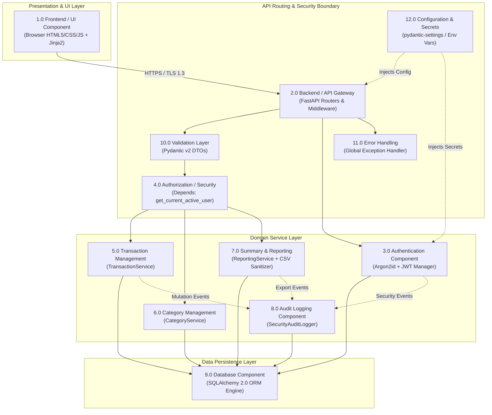
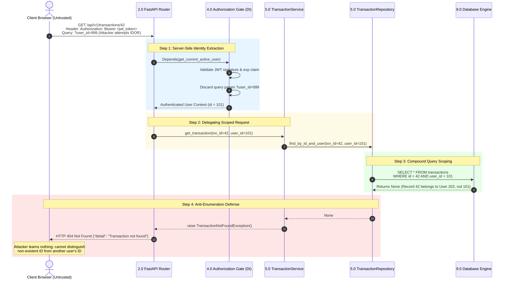

# Phase 5: Software Architecture and Design Engineering

**Project Title:** Secure Personal Expense Management Application (SPEMA)  
**Document ID:** SPEMA-DOC-PH05  
**Course Code:** 24CYS401 – Secure Software Engineering Laboratory  
**Document Path:** `docs/phases/phase-05-architecture.md`  
**Classification:** Laboratory Examination Artifact – High Integrity  
**Status:** Approved Baseline  

---

## 1. Executive Summary & Architectural Style Selection

Building upon the foundations of Phase 1 through Phase 4, Phase 5 establishes the system architecture and component designs for the **Secure Personal Expense Management Application**.

### 1.1 Selected Architectural Style: Modular Layered Monolith

For this laboratory examination project, the architecture is selected as a **Modular Layered Monolith** (Clean / Hexagonal-Inspired Monolith):

```
+--------------------------------------------------------------------------------------------------+
| 1. PRESENTATION LAYER: Web Browser UI / Jinja2 Server Templates / REST API Gateway               |
+--------------------------------------------------------------------------------------------------+
                                                |  DTOs / JSON Payloads
                                                v
+--------------------------------------------------------------------------------------------------+
| 2. VALIDATION & SECURITY INTERCEPTOR LAYER: Pydantic v2 / OAuth2 JWT Dependency Injection        |
+--------------------------------------------------------------------------------------------------+
                                                |  Validated DTOs + Authenticated User Context
                                                v
+--------------------------------------------------------------------------------------------------+
| 3. DOMAIN & SERVICE LAYER: AuthService, TransactionService, CategoryService, ReportingService   |
+--------------------------------------------------------------------------------------------------+
                                                |  Tenant-Scoped Domain Commands
                                                v
+--------------------------------------------------------------------------------------------------+
| 4. PERSISTENCE & REPOSITORY LAYER: SQLAlchemy Repositories (Mandatory user_id compound queries)   |
+--------------------------------------------------------------------------------------------------+
                                                |  Parameterized SQL Expressions
                                                v
+--------------------------------------------------------------------------------------------------+
| 5. DATABASE STORAGE PERIMETER: Relational SQLite (WAL) / PostgreSQL Database Engine              |
+--------------------------------------------------------------------------------------------------+
```

### 1.2 Justification Against Microservices (Anti-Bloat Principle)
- **Zero Distributed Latency / Network Hop Vulnerabilities:** In a microservices architecture, identity and claims must be repeatedly passed across internal HTTP networks, introducing token forgery, perimeter bypass, and complex service mesh overhead.
- **Atomic ACID Transactions:** Managing personal financial ledgers requires ACID guarantees (e.g. updating categories, creating income/expense rows, and recording audit logs). A modular monolith executes these operations in a single local database transaction without distributed two-phase commit overhead.
- **Laboratory Deployability:** Packages cleanly into a single, secure, non-root Docker container deployable to Kubernetes/Minikube with minimal resource footprint (<256MB RAM), satisfying `NFR-002` and `NFR-006`.

---

## 2. Comprehensive Component Specifications

The application decomposes into twelve distinct, loosely coupled components:



---

### Component Detail Specifications (1 to 12)

#### 1. Frontend / UI Component
- **Responsibility:** Renders interactive user interfaces (Registration, Login, Expense Dashboard, Search Filter Bar, Monthly Summary Cards, CSV Export trigger).
- **Interfaces:** HTML5 / CSS (Bootstrap or Tailwind CDN) / Fetch API for asynchronous REST communication; Jinja2 server-rendered templates for authenticated pages.
- **Inputs:** User form inputs, filter selections, button clicks.
- **Outputs:** HTTP requests with JSON payloads and Bearer tokens; rendered DOM.
- **Trust Level:** **Untrusted (Client Perimeter).** Runs entirely within the user agent.
- **Security Controls:**
  - Context-aware HTML entity encoding on all dynamic fields (`SEC-010`).
  - Strict Content Security Policy (`default-src 'self'`).
  - Stores JWT access token strictly in browser memory or `HttpOnly; SameSite=Strict; Secure` session cookies.

#### 2. Backend / API Gateway
- **Responsibility:** Central HTTP ingress point; routes incoming requests, applies global middleware (CORS, security headers, rate limiting), and manages request lifecycles.
- **Interfaces:** FastAPI `APIRouter` instances mounted under `/api/v1/` (`/auth`, `/transactions`, `/categories`, `/reports`, `/healthz`).
- **Inputs:** Incoming HTTP requests over TLS 1.3.
- **Outputs:** HTTP JSON responses and streamed CSV responses.
- **Trust Level:** **Trusted (Application Boundary).**
- **Security Controls:**
  - Rate limiting middleware enforcing at most 5 auth attempts per 15 min (`SEC-003`).
  - Security headers middleware (`HSTS`, `X-Content-Type-Options: nosniff`, `X-Frame-Options: DENY`, `Content-Security-Policy`).
  - Global payload size limiter rejecting requests > 1 MB (`SEC-017`).

#### 3. Authentication Component (`AuthService`)
- **Responsibility:** Manages user onboarding, credential verification, cryptographic password hashing, token issuance, and token revocation.
- **Interfaces:** Python interface `IAuthService` exposing `register()`, `authenticate_user()`, `create_access_token()`, and `revoke_token()`.
- **Inputs:** `UserCreateDTO` (email, username, password), `LoginCredentialsDTO`.
- **Outputs:** `TokenResponseDTO` (signed JWT `access_token`, `token_type`, `expires_in`), `UserResponseDTO`.
- **Trust Level:** **Trusted (Security Core).**
- **Security Controls:**
  - **Argon2id** password hashing with per-user cryptographic salt (`SEC-001`).
  - Minimum 10-character password policy validator (`SEC-002`).
  - HMAC-SHA256 signed JWTs with 30-minute expiration (`SEC-004`).
  - Blacklists revoked tokens via `revoked_tokens` table upon logout (`FR-003`).

#### 4. Authorization / Security Component (`SecurityContext`)
- **Responsibility:** Acts as the unbypassable gatekeeper. Extracts token from HTTP `Authorization` header, verifies cryptographic signature, checks revocation, extracts `user_id`, and injects `current_user` into service dependencies.
- **Interfaces:** FastAPI Dependency `get_current_active_user(token: str = Depends(oauth2_scheme)) -> User`.
- **Inputs:** HTTP `Authorization: Bearer <token>` header.
- **Outputs:** Verified, authenticated `User` domain entity representing caller identity.
- **Trust Level:** **Trusted (Authorization Boundary).**
- **Security Controls:**
  - **Zero Client Trust:** Any client-supplied `user_id` in path, query, or body parameters is ignored or stripped (`SEC-005`, `SEC-007`).
  - Uniform `HTTP 401 Unauthorized` emitted on invalid, expired, or tampered signatures.
  - Verifies token JTI against `revoked_tokens` table.

#### 5. Transaction Management (`TransactionService` & `TransactionRepository`)
- **Responsibility:** Coordinates creation, modification, deletion, retrieval, and search of income and expense ledger entries.
- **Interfaces:** `ITransactionService` exposing `create_transaction()`, `get_transaction_by_id()`, `list_transactions()`, `update_transaction()`, `delete_transaction()`.
- **Inputs:** Authenticated `current_user.id`, `TransactionCreateDTO`, `TransactionUpdateDTO`, `TransactionFilterParams`.
- **Outputs:** `TransactionResponseDTO`, `List[TransactionResponseDTO]`.
- **Trust Level:** **Trusted (Domain Core).**
- **Security Controls:**
  - **Enforces Primary Security Invariant:** Every repository method takes `user_id: int` derived from the session as an obligatory parameter.
  - Compound query execution: `WHERE id = :id AND user_id = :user_id`.
  - Emits uniform `HTTP 404 Not Found` if a transaction exists under another user ID, preventing integer ID probing (`SEC-006`).

#### 6. Category Management (`CategoryService` & `CategoryRepository`)
- **Responsibility:** Manages taxonomy classifications. Retrieves system default categories and allows users to create private custom categories.
- **Interfaces:** `ICategoryService` exposing `get_accessible_categories(user_id)`, `create_custom_category(user_id, data)`.
- **Inputs:** Authenticated `current_user.id`, `CategoryCreateDTO`.
- **Outputs:** `List[CategoryResponseDTO]`.
- **Trust Level:** **Trusted (Domain Core).**
- **Security Controls:**
  - Query filtering: `WHERE is_system = TRUE OR user_id = :user_id`.
  - Uniqueness constraint: `UNIQUE(user_id, name)` preventing duplicate custom tags.
  - Prohibits standard users from altering or deleting system categories (`is_system = TRUE`).

#### 7. Summary & Reporting Component (`ReportingService` & `SecureCSVExporter`)
- **Responsibility:** Computes monthly financial summaries and streams secure CSV reports.
- **Interfaces:** `IReportingService` exposing `get_monthly_summary(user_id, year, month)`, `export_csv_report(user_id, filters)`.
- **Inputs:** Authenticated `current_user.id`, date filters, category filters.
- **Outputs:** `MonthlySummaryDTO`, Streaming HTTP Response (`text/csv`).
- **Trust Level:** **Trusted (Domain Core).**
- **Security Controls:**
  - Aggregation queries strictly scoped by `WHERE user_id = :current_user.id` (`SEC-012`).
  - Exact fixed-point decimal arithmetic (no floating-point rounding errors) (`NFR-003`).
  - **Formula Injection Neutralization (`SecureCSVExporter`):** Prefixes any text starting with `=`, `+`, `-`, `@`, `\t`, `\r` with `'` to neutralize CWE-1236 (`SEC-011`).

#### 8. Audit Logging Component (`SecurityAuditLogger`)
- **Responsibility:** Records immutable structured JSON security logs for authentication, authorization, data mutations, and reporting events.
- **Interfaces:** `IAuditLogger` exposing `log_security_event(event_type, user_id, client_ip, resource, status, details)`.
- **Inputs:** Security event context and metadata.
- **Outputs:** Persisted `audit_logs` records and stdout JSON log streams.
- **Trust Level:** **Trusted (Infrastructure Core).**
- **Security Controls:**
  - **Sensitive Data Masking:** Passwords, hashes, tokens, and PII are stripped before persistence (`SEC-016`).
  - Asynchronous / non-blocking execution so logging failures do not interrupt user requests.

#### 9. Database Component (`DatabaseEngine`)
- **Responsibility:** Relational persistence, connection pooling, ACID transaction management, and constraint enforcement.
- **Interfaces:** SQLAlchemy 2.0 ORM session factory (`get_db` dependency).
- **Inputs:** Parameterized SQL queries and ORM entity instances.
- **Outputs:** Relational rows and query result sets.
- **Trust Level:** **Trusted (Persistence Perimeter).**
- **Security Controls:**
  - Exclusively parameterized queries; raw string concatenation prohibited (`SEC-009`).
  - Connection credentials loaded from environment variables (`SEC-014`).
  - Foreign key cascades and `NOT NULL` constraints enforcing schema-level ownership.

#### 10. Validation Layer (`Pydantic Schemas`)
- **Responsibility:** Gatekeeper for request payloads and query strings; enforces whitelist schemas, strict type conversions, and range boundaries.
- **Interfaces:** Pydantic v2 BaseModels (`UserCreate`, `TransactionCreate`, `FilterParams`).
- **Inputs:** Raw JSON request bodies and query parameters.
- **Outputs:** Strongly-typed, validated Python DTO objects.
- **Trust Level:** **Trusted (Validation Perimeter).**
- **Security Controls:**
  - Positive decimal validation (`0.01 <= amount <= 1,000,000.00`) (`SEC-008`).
  - String length bounds and regex constraints preventing buffer/format abuse.
  - `extra = "forbid"` setting rejecting unexpected or injected fields.

#### 11. Secure Error Handling Component
- **Responsibility:** Intercepts unhandled exceptions across all layers, translates them into generic safe HTTP responses, and logs internal stack traces securely.
- **Interfaces:** FastAPI exception handlers (`@app.exception_handler(Exception)`).
- **Inputs:** Uncaught exceptions, validation errors, database errors.
- **Outputs:** Sanitized JSON error objects (`HTTP 500` with unique `error_id`).
- **Trust Level:** **Trusted (Cross-Cutting).**
- **Security Controls:**
  - Stack traces, database schema details, and file system paths are completely hidden from clients in production mode (`SEC-018`).
  - Generates a UUID `error_id` correlating client error messages with internal logs for debugging.

#### 12. Configuration & Secrets Component (`Settings`)
- **Responsibility:** Centralized management of application configuration and cryptographic keys.
- **Interfaces:** Pydantic `BaseSettings` singleton (`settings = get_settings()`).
- **Inputs:** Runtime OS environment variables (`APP_ENV`, `SECRET_KEY`, `DATABASE_URL`).
- **Outputs:** Strongly typed configuration properties.
- **Trust Level:** **Trusted (Infrastructure Root).**
- **Security Controls:**
  - Zero hardcoded defaults for sensitive keys (`SEC-014`).
  - Startup verification: fails immediately if `SECRET_KEY` has fewer than 32 bytes of entropy.

---

## 3. Explicit Enforcement of Transaction Access Pattern

The primary security requirement mandates:
> **A user must NEVER be able to access another user's financial records.**
> 
> The application must enforce:
> `authenticated_user_id` -> authorization check -> user-scoped query -> database
> *rather than:*
> `client_supplied_user_id` -> database.

### 3.1 Architectural Execution Flow



### 3.2 Code Pattern Comparison

#### Insecure Anti-Pattern (Vulnerable to IDOR / BOLA)
```python
# VULNERABLE CONTROLLER (Anti-Pattern)
@router.get("/transactions/{transaction_id}")
def get_txn_insecure(transaction_id: int, user_id: int, db: Session = Depends(get_db)):
    # Flaw 1: Accepts client_supplied_user_id
    # Flaw 2: Queries record solely by transaction_id
    record = db.query(Transaction).filter(Transaction.id == transaction_id).first()
    if not record:
        raise HTTPException(404)
    # Flaw 3: If user_id is checked here, client controls user_id anyway
    return record
```

#### Secure Enterprise Pattern (Strict Server-Side Derivation)
```python
# SECURE ARCHITECTURAL PATTERN
@router.get("/transactions/{transaction_id}", response_model=TransactionResponseDTO)
def get_txn_secure(
    transaction_id: int = Path(..., ge=1),
    # Server-derived identity; client cannot spoof or provide user_id
    current_user: User = Depends(get_current_active_user),
    service: TransactionService = Depends(get_transaction_service)
):
    # Enforces: authenticated_user_id -> service -> user-scoped query
    transaction = service.get_transaction(
        transaction_id=transaction_id, 
        user_id=current_user.id
    )
    if not transaction:
        # Uniform 404 response eliminates identifier enumeration (SEC-006)
        raise HTTPException(status_code=404, detail="Transaction not found")
    return transaction
```

---

## 4. Applicable Design Concepts and Patterns

To ensure architectural integrity, maintainability, and security resilience, six industry-standard design patterns are selected:

### 1. Layered Architecture (Separation of Concerns)
- **Concept:** Organizes the system into strict horizontal layers (Presentation -> Application/Security -> Domain Services -> Persistence -> Database).
- **Security & Maintainability Benefit:** Enforces unidirectional control flow. Presentation routers are physically prohibited from issuing direct database queries, ensuring that every data operation must pass through domain validation and authorization policies.

### 2. Repository Pattern with Mandatory Tenant Scoping
- **Concept:** Encapsulates data access mechanisms behind strongly-typed repository classes (`TransactionRepository`, `CategoryRepository`).
- **Security & Maintainability Benefit:** Eliminates scattered raw SQL queries. Every query method targeting transactions requires `user_id: int` as an obligatory argument and hardcodes `WHERE user_id = :user_id` into the query predicate, preventing accidental cross-tenant data leaks.

### 3. Dependency Injection (DI) for Security Context
- **Concept:** Leverages FastAPI's dependency injection system to resolve database sessions, configuration objects, and authenticated user credentials.
- **Security & Maintainability Benefit:** Guaranteed authorization enforcement. A route declaring `current_user: User = Depends(get_current_active_user)` **cannot physically execute** if the request lacks a cryptographically valid token.

### 4. Data Transfer Object (DTO) & Validation Boundary Pattern
- **Concept:** Distinct Pydantic schemas for requests (`TransactionCreateDTO`) and responses (`TransactionResponseDTO`).
- **Security & Maintainability Benefit:** Establishes a strict validation boundary at the system edge. Mass assignment vulnerabilities (CWE-915) are eliminated because internal fields (such as `id`, `user_id`, `created_at`) cannot be overwritten by client payloads.

### 5. Centralized Authorization Policy (Intercepting Filter / Guard)
- **Concept:** Centralizes JWT signature validation, token revocation checking, and user identity extraction into a single interceptor (`get_current_active_user`).
- **Security & Maintainability Benefit:** Eliminates duplicated, error-prone authorization checks scattered across individual route handlers. Security updates (such as token algorithm upgrades or session timeouts) are applied globally in one location.

### 6. Secure Exception Handling (Facade / Error Translation)
- **Concept:** Global exception handling middleware that catches all uncaught exceptions, logs detailed diagnostic traces internally, and translates them into sanitized, generic HTTP responses.
- **Security & Maintainability Benefit:** Eliminates information disclosure (CWE-209). Database schema details, SQL syntax errors, and server file paths are completely shielded from potential attackers.

---

## 5. Traceability & Consistency Verification

| Architectural Component | Mapped Requirements (Phase 2) | Mapped Use Cases (Phase 3) | Mapped ER Entities (Phase 4) | Mapped DFD Processes (Phase 4) | Consistency Check |
| :--- | :--- | :--- | :--- | :--- | :---: |
| **Frontend / UI** | `NFR-004`, `SEC-010` | `UC-01` to `UC-14` | N/A | Untrusted Browser Perimeter | **100% Consistent** |
| **API Gateway & Routers** | `NFR-001`, `SEC-003`, `SEC-017` | `TransactionRouterAPI` | N/A | Process 0.0 & Process 2.0 | **100% Consistent** |
| **AuthService** | `FR-001`-`FR-003`, `SEC-001`-`SEC-004` | `UC-01`-`UC-03`, `UC-Auth` | `users`, `revoked_tokens` | Process 1.0 (Auth Service) | **100% Consistent** |
| **Authorization Gate** | `SEC-005`, `SEC-006`, `SEC-007` | `UC-Auth`, `UC-Authz` | `transactions.user_id` FK | Process 2.0 (Tenancy Gate) | **100% Consistent** |
| **TransactionService** | `FR-004`, `FR-005`, `FR-008`, `FR-009` | `UC-04`, `UC-05`, `UC-07`-`UC-10` | `transactions` table | Process 3.0 (Transaction Service)| **100% Consistent** |
| **CategoryService** | `FR-006` | `UC-06` | `categories` table | Process 3.0 & Data Store D2 | **100% Consistent** |
| **ReportingService** | `FR-007`, `FR-010`, `SEC-011`, `SEC-012` | `UC-11`, `UC-12` | `transactions` table | Process 4.0 & Process 5.0 | **100% Consistent** |
| **AuditLogger** | `SEC-015`, `SEC-016` | `UC-14`, `UC-16` | `audit_logs` table | Process 6.0 (Audit Service) | **100% Consistent** |
| **Database Engine** | `NFR-003`, `SEC-009` | `TransactionEntity` | Relational SQLite/Postgres | Data Stores D1, D2, D3, D4 | **100% Consistent** |
| **Validation Layer** | `SEC-008` | `UC-Validate` | Schema constraints | Process 2.3 (Schema Validator) | **100% Consistent** |
| **Error Handling** | `SEC-006`, `SEC-018` | Exception Flows | N/A | Process 3.2 (Anti-Enumeration)| **100% Consistent** |
| **Configuration** | `SEC-014` | N/A | N/A | Cross-Cutting Security Base | **100% Consistent** |

---

## 6. Phase 5 Laboratory Artifact Summary

### 6.1 Artifacts Created & Stored
1. **Primary Laboratory Documentation:**  
   [`docs/phases/phase-05-architecture.md`](file:///C:/Users/anand/OneDrive/Documents/SSDLC/endsem_lab/docs/phases/phase-05-architecture.md)
2. **Editable draw.io Diagram Files:**  
   - Software Architecture Diagram: [`docs/diagrams/software_architecture.drawio`](file:///C:/Users/anand/OneDrive/Documents/SSDLC/endsem_lab/docs/diagrams/software_architecture.drawio)
   - Security Architecture View: [`docs/diagrams/security_architecture.drawio`](file:///C:/Users/anand/OneDrive/Documents/SSDLC/endsem_lab/docs/diagrams/security_architecture.drawio)
   - Architecture Reference Copy: [`docs/architecture/architecture_diagram.drawio`](file:///C:/Users/anand/OneDrive/Documents/SSDLC/endsem_lab/docs/architecture/architecture_diagram.drawio)

### 6.2 Upstream Dependencies
- Consumes **Rugged Agile process framework** from Phase 1 (`docs/phases/phase-01-agile.md`).
- Realizes **Requirements `FR-001` - `FR-012` and `SEC-001` - `SEC-018`** from Phase 2 (`docs/phases/phase-02-requirements.md`).
- Formalizes the **UML Use Cases and BCE Analysis Model** from Phase 3 (`docs/phases/phase-03-uml.md`).
- Implements the **ER schema and DFD Level 0, 1, and 2 trust boundaries** from Phase 4 (`docs/phases/phase-04-data-flow.md`).

### 6.3 Downstream Hand-Off
- **Phase 6 (User Interface Design):** Will design wireframes and UI components matching the Presentation and Validation boundaries.
- **Phase 7 (Threat Modeling & STRIDE):** Will analyze component interfaces, data assets, and trust boundaries defined in this architecture.
- **Phase 11 & 12 (Secure Development & Coding):** Will directly code the FastAPI routers, Pydantic schemas, and SQLAlchemy repositories according to these component interfaces.
- **Phase 13 (Docker & Kubernetes):** Will containerize this modular monolith based on the clean single-container specification.
