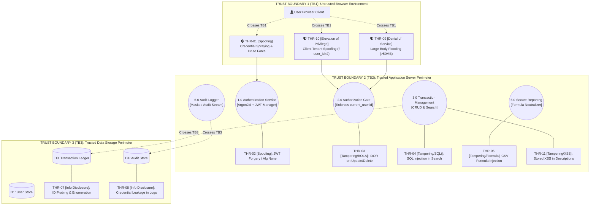

# Phase 7: Threat Modeling and Security Analysis

**Project Title:** Secure Personal Expense Management Application (SPEMA)  
**Document ID:** SPEMA-DOC-PH07  
**Course Code:** 24CYS401 – Secure Software Engineering Laboratory  
**Document Path:** `docs/phases/phase-07-threat-modeling.md`  
**Classification:** Laboratory Examination Artifact – High Integrity  
**Status:** Approved Baseline  

---

## 1. Executive Summary & Document Structure

Phase 7 performs the formal **Threat Modeling and Security Analysis** for the Secure Personal Expense Management Application, executing four in-depth analytical activities across dedicated documentation artifacts:

1. **Part A: Asset Inventory & CIA Classification** -> [`docs/security/threat-model.md`](file:///C:/Users/anand/OneDrive/Documents/SSDLC/endsem_lab/docs/security/threat-model.md)
   - Cataloged 10 security-relevant assets (`AST-01` to `AST-10`) with ownership, CIA triad classification, business impact, and protection mechanisms.
2. **Part B: STRIDE Threat Analysis** -> [`docs/security/stride.md`](file:///C:/Users/anand/OneDrive/Documents/SSDLC/endsem_lab/docs/security/stride.md)
   - Systematically applied STRIDE to all approved Phase 4 DFD elements across trust boundaries TB1, TB2, and TB3.
   - Identified and analyzed 11 realistic technical threats (`THR-01` to `THR-11`) with preconditions, impacts, likelihood, risk scores, mitigations, and detection triggers.
3. **Part C: Information Flow Analysis** -> [`docs/security/information-flow.md`](file:///C:/Users/anand/OneDrive/Documents/SSDLC/endsem_lab/docs/security/information-flow.md)
   - Detailed lifecycle tracing for three sensitive assets:
     - *Asset 1: User Credentials (Passwords / Hashes)*
     - *Asset 2: Authentication Session Tokens (JWT)*
     - *Asset 3: Financial Transaction Records & Exported Reports*
   - Analyzed trusted/untrusted transitions, trust boundary crossings, potential leakage vectors, and non-bypassable authorization checkpoints.
4. **Part D: Concrete Vulnerability Analysis** -> [`docs/security/vulnerabilities.md`](file:///C:/Users/anand/OneDrive/Documents/SSDLC/endsem_lab/docs/security/vulnerabilities.md)
   - Analyzed 6 concrete vulnerabilities prioritized by risk:
     - `VULN-01` BOLA / IDOR in Transactions (`CWE-639`) — **Critical**
     - `VULN-02` SQL Injection in Transaction Search (`CWE-89`) — **Critical**
     - `VULN-03` CSV / Spreadsheet Formula Injection (`CWE-1236`) — **High**
     - `VULN-04` Credential Stuffing & Password Brute Forcing (`CWE-307`) — **High**
     - `VULN-05` Sensitive Credential Leakage in Logs (`CWE-532`) — **High**
     - `VULN-06` Stored XSS in Descriptions (`CWE-79`) — **High**
   - Provided concrete exploit scenarios, architectural mitigations, and automated verification test assertions.

---

## 2. Visual STRIDE Threat Architecture Diagram

---

## 3. Consistency Check Against DFD, Architecture, and Requirements

| Threat / Vulnerability | Phase 2 Requirement | Phase 3 Use Case | Phase 4 DFD Element | Phase 5 Architecture Component | Status |
| :--- | :--- | :--- | :--- | :--- | :---: |
| **`THR-01` / `VULN-04`** (Brute Force) | `SEC-001`, `SEC-003` | `UC-02: Login` | Process 1.0 (Auth) | `AuthService`, Rate Limiter | **100% Consistent** |
| **`THR-02`** (JWT Forgery) | `SEC-004`, `SEC-014` | `UC-Auth` | Process 2.0 (Gate) | Security Interceptor (DI) | **100% Consistent** |
| **`THR-03` / `VULN-01`** (BOLA / IDOR) | `SEC-005`, `SEC-006` | `UC-Authz`, `UC-09/10` | Process 3.0 / Store D3 | `TransactionRepository` compound query | **100% Consistent** |
| **`THR-04` / `VULN-02`** (SQL Injection)| `SEC-008`, `SEC-009` | `UC-08: Search` | Process 3.0 / Store D3 | Parameterized SQLAlchemy ORM | **100% Consistent** |
| **`THR-05` / `VULN-03`** (CSV Injection)| `SEC-011`, `SEC-012` | `UC-12: Report` | Process 5.0 (Reports) | `SecureCSVExporter` formula prefix | **100% Consistent** |
| **`THR-07`** (ID Enumeration) | `SEC-006` | Exception Flows | Process 3.2 | Anti-Enumeration 404 Formatter | **100% Consistent** |
| **`THR-08` / `VULN-05`** (Log Leakage) | `SEC-015`, `SEC-016` | `UC-14`, `UC-16` | Process 6.0 / Store D4 | `SecurityAuditLogger` Masking | **100% Consistent** |
| **`THR-10`** (Tenant Spoofing) | `SEC-005`, `SEC-007` | `UC-TXN-01`, `UC-REP-01`| Process 2.0 (Gate) | Pydantic DTO Schema Stripping | **100% Consistent** |
| **`THR-11` / `VULN-06`** (Stored XSS) | `SEC-010` | UI Forms | Store D3 -> UI View | Jinja2 Context HTML Escaping & CSP | **100% Consistent** |

---

## 4. Phase 7 Laboratory Artifact Summary

### 4.1 Artifacts Created & Stored
1. **Primary Laboratory Documentation:**  
   [`docs/phases/phase-07-threat-modeling.md`](file:///C:/Users/anand/OneDrive/Documents/SSDLC/endsem_lab/docs/phases/phase-07-threat-modeling.md)
2. **Dedicated Security Artifacts (under `docs/security/`):**  
   - Master Asset Inventory & Threat Model: [`docs/security/threat-model.md`](file:///C:/Users/anand/OneDrive/Documents/SSDLC/endsem_lab/docs/security/threat-model.md)
   - Systematic STRIDE Analysis (11 Threats): [`docs/security/stride.md`](file:///C:/Users/anand/OneDrive/Documents/SSDLC/endsem_lab/docs/security/stride.md)
   - Detailed Information Flow Analysis (3 Assets): [`docs/security/information-flow.md`](file:///C:/Users/anand/OneDrive/Documents/SSDLC/endsem_lab/docs/security/information-flow.md)
   - Concrete Vulnerability Analysis (6 Vulnerabilities): [`docs/security/vulnerabilities.md`](file:///C:/Users/anand/OneDrive/Documents/SSDLC/endsem_lab/docs/security/vulnerabilities.md)
3. **Editable draw.io Diagram File:**  
   - STRIDE Threat Model Diagram: [`docs/diagrams/stride_threat_model.drawio`](file:///C:/Users/anand/OneDrive/Documents/SSDLC/endsem_lab/docs/diagrams/stride_threat_model.drawio)

### 4.2 Upstream Dependencies
- Derived directly from **Phase 2 Security Requirements (`SEC-001` - `SEC-018`)**, **Phase 4 DFD Elements & Trust Boundaries (TB1, TB2, TB3)**, and **Phase 5 Component Architectures**.

### 4.3 Downstream Hand-Off
- **Phase 8 (Attack Tree & Refinement):** Will model hierarchical attack paths targeting the highest-risk threats (`THR-03` BOLA, `THR-04` SQLi, `THR-01` Credential Spraying) to refine architecture defenses.
- **Phase 9 & 10 (Product Backlog & Scrum):** Will ingest these threats as formal **Evil User Stories / Abuser Stories** with dedicated verification criteria in Sprint 1 and Sprint 2.
- **Phase 12 (Secure Coding & Refactoring):** Will implement the specific code patterns neutralizing `VULN-01` through `VULN-06`.
- **Phase 14 (Security Testing & Fuzzing):** Will write and execute automated penetration test scripts asserting that all 6 vulnerabilities cannot be exploited.
