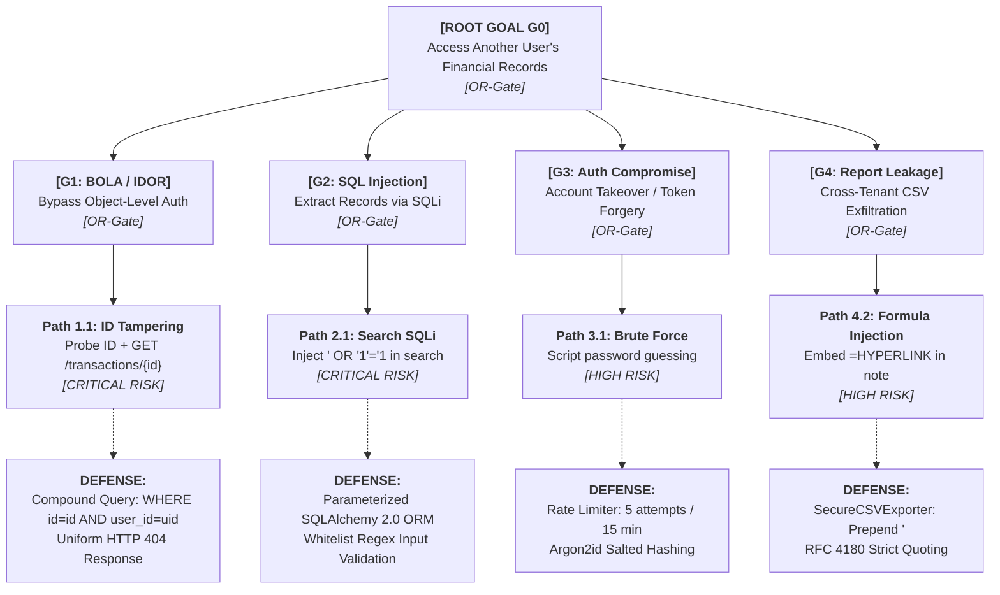

# Phase 8: Attack Tree and Security Architecture Refinement

**Project Title:** Secure Personal Expense Management Application (SPEMA)  
**Document ID:** SPEMA-DOC-PH08  
**Course Code:** 24CYS401 – Secure Software Engineering Laboratory  
**Document Path:** `docs/phases/phase-08-attack-tree.md`  
**Classification:** Laboratory Examination Artifact – High Integrity  
**Status:** Approved Baseline  

---

## 1. Executive Summary & Document Structure

Phase 8 executes the adversary-centric **Attack Tree Analysis and Security Architecture Refinement** for the Secure Personal Expense Management Application, delivering two primary technical documents and an editable draw.io diagram:

1. **Attack Tree Model (`docs/security/attack-tree.md`):**  
   - Selected Primary Attacker Goal: **[ROOT GOAL G0] Access another user's financial records**.
   - Developed hierarchical AND/OR attack branches covering:
     - `G1`: Direct Object-Level Authorization Bypass (BOLA / IDOR).
     - `G2`: SQL Injection in Search and Filtering.
     - `G3`: Authentication & Session Compromise.
     - `G4`: Cross-Tenant Report Manipulation & Exfiltration.
     - `G5`: Log Harvesting & Information Disclosure.
   - Identified **Path 1.1 (BOLA/IDOR)** and **Path 2.1 (SQL Injection)** as the highest-risk critical paths.
2. **Security Architecture Refinement (`docs/security/architecture-refinement.md`):**  
   - Hardened system defenses across seven architectural pillars:
     - *Pillar 1:* Authentication Hardening (Argon2id + 5-try rate limiter).
     - *Pillar 2:* Centralized Authorization & Zero-Trust Tenancy Gate.
     - *Pillar 3:* User Ownership Checks & Compound Query Invariants.
     - *Pillar 4:* Obligatory Repository Tenant Interface Typing (`user_id: int` mandatory on all methods).
     - *Pillar 5:* Strict Whitelist Validation & Pydantic Boundary Hardening (`extra = "forbid"`).
     - *Pillar 6:* Secure Financial Report Generation (`SecureCSVExporter` prepending `'`).
     - *Pillar 7:* Masked Tamper-Resistant Security Auditing (`SecurityAuditLogger`).
   - Documented architecture deltas and rationale.
   - Provided a concrete Python code proof verifying design decisions.
3. **Editable Diagram (`docs/diagrams/attack_tree.drawio`):**  
   - Formal draw.io visual attack tree diagram depicting root goal, sub-goals, attack paths, AND/OR logic gates, preventive controls, and detective controls.

---

## 2. Visual Attack Tree Diagram Overview

---

## 3. Consistency Check Across SSDLC Phases

| Phase | Artifact | Alignment with Phase 8 Refinements | Consistency Status |
| :---: | :--- | :--- | :---: |
| **Phase 2** | Requirements Engineering | Fully satisfies `SEC-001`, `SEC-003`, `SEC-005`, `SEC-006`, `SEC-008`, `SEC-009`, `SEC-011`, `SEC-016`. | **100% Consistent** |
| **Phase 3** | UML Use Cases & BCE Model | Adheres to `UC-TXN-01`, `UC-REP-01`, and `AuthenticationInterceptor` control sequence flows. | **100% Consistent** |
| **Phase 4** | ER & DFD Models | Enforces `transactions.user_id` NOT NULL foreign key and compound query scoping across TB1, TB2, and TB3. | **100% Consistent** |
| **Phase 5** | Software Architecture | Refines repository signatures and validation boundary without introducing architectural changes. | **100% Consistent** |
| **Phase 6** | UI Design | Aligns with anti-data leakage rules and uniform 404 response handling across all 6 screens. | **100% Consistent** |
| **Phase 7** | Threat Modeling | Directly mitigates threats `THR-01` through `THR-11` and vulnerabilities `VULN-01` through `VULN-06`. | **100% Consistent** |

---

## 4. Phase 8 Laboratory Artifact Summary

### 4.1 Artifacts Created & Stored
1. **Primary Laboratory Documentation:**  
   [`docs/phases/phase-08-attack-tree.md`](file:///C:/Users/anand/OneDrive/Documents/SSDLC/endsem_lab/docs/phases/phase-08-attack-tree.md)
2. **Dedicated Security Artifacts (under `docs/security/`):**  
   - Detailed Attack Tree Analysis: [`docs/security/attack-tree.md`](file:///C:/Users/anand/OneDrive/Documents/SSDLC/endsem_lab/docs/security/attack-tree.md)
   - Security Architecture Refinement (7 Pillars & Code Proof): [`docs/security/architecture-refinement.md`](file:///C:/Users/anand/OneDrive/Documents/SSDLC/endsem_lab/docs/security/architecture-refinement.md)
3. **Editable draw.io Diagram File:**  
   - Attack Tree Diagram: [`docs/diagrams/attack_tree.drawio`](file:///C:/Users/anand/OneDrive/Documents/SSDLC/endsem_lab/docs/diagrams/attack_tree.drawio)

### 4.2 Upstream Dependencies
- Consumes **Security Requirements `SEC-001` - `SEC-018`** from Phase 2, **Use Case Specifications** from Phase 3, **DFD Level 0-2 & Trust Boundaries** from Phase 4, **Component Architecture** from Phase 5, and the **STRIDE Threat & Vulnerability Models** from Phase 7.

### 4.3 Downstream Hand-Off
- **Phase 9 (Product Backlog & Jira/Scrum):** Will translate these refined architectural invariants, defense controls, and highest-risk attack paths into User Stories, Abuser/Evil User Stories, and Acceptance Criteria.
- **Phase 10 (Sprint Execution & Metrics):** Will schedule high-risk defense implementations into Sprint 1 and Sprint 2.
- **Phase 11 & 12 (Secure Build, Coding & Refactoring):** Will physically implement the hardened `TransactionRepository`, Pydantic `extra = "forbid"` schemas, and `SecureCSVExporter`.
- **Phase 14 (CI/CD & Security Testing):** Will write negative test suites specifically targeting the attack paths modeled in this attack tree.
