# Phase 14: CI/CD and Security Testing

**Project:** Secure Personal Expense Management Application (SPEMA)  
**Curriculum:** 24CYS401 Secure Software Engineering Laboratory  
**Document Version:** 1.3.0  
**Status:** Approved & Verified  
**Release Tag:** `v1.3.0`  

---

## 1. Executive Summary & Objectives

Phase 14 establishes a comprehensive, automated quality and security gate pipeline integrated directly into GitHub Actions (`.github/workflows/ci.yml`). Conforming to SSDLC guidelines, every push and pull request executes 13 automated stages verifying dependency integrity, code quality, static security, functional integration, tenant isolation, property-based invariants, container security, and Kubernetes manifests.

During the execution of Phase 14 security testing, **two real security defects** were uncovered, documented, fixed, and verified with dedicated regression tests. The test suite was expanded to **46 passing tests**, establishing complete test coverage across unit, integration, API, security, and property-based domains.

---

## 2. CI/CD Pipeline Architecture (`.github/workflows/ci.yml`)

The GitHub Actions pipeline serves as the central automated quality/security gate for the repository. It is partitioned across three orchestrated jobs:

```mermaid
flowchart TD
    subgraph Job1["Job 1: Security & Quality Gate"]
        S1["Stage 1: Checkout"] --> S2["Stage 2: Install Dependencies"]
        S2 --> S3["Stage 3: Pip-Audit Vulnerability Check"]
        S3 --> S4["Stage 4: Secret & Git Hygiene Scan"]
        S4 --> S5["Stage 5: Ruff Linting & Standards"]
        S5 --> S6["Stage 6: Bandit SAST Scan"]
    end

    subgraph Job2["Job 2: Automated Testing Suite"]
        T1["Checkout & Setup"] --> T2["Stage 7: Unit Tests"]
        T2 --> T3["Stage 8: Integration Tests"]
        T3 --> T4["Stage 9: System & API Tests"]
        T4 --> T5["Stage 10: Security & IDOR Tests"]
        T5 --> T6["Stage 11: Hypothesis Property Tests"]
        T6 --> T7["Stage 12: Application Smoke Test"]
    end

    subgraph Job3["Job 3: Container & K8s Validation"]
        C1["Checkout & Docker Setup"] --> C2["Stage 13a: Docker Build"]
        C2 --> C3["Stage 13b: Non-Root User Verification (UID 10001)"]
        C3 --> C4["Stage 13c: Container Healthcheck"]
        C4 --> C5["Stage 13d: Kubectl Kustomize Validation"]
    end

    Job1 --> Job2
    Job1 --> Job3
```



### 2.1 Thirteen Pipeline Stages Overview

| Stage | Name | Tool / Mechanism | Pass Criteria |
|---|---|---|---|
| **1** | Repository Checkout | `actions/checkout@v4` | Clean git working tree |
| **2** | Dependency Installation | `pip install -r requirements.txt -r requirements-dev.txt` | Clean dependency resolution |
| **3** | Dependency Auditing | `pip-audit` | Zero known CVEs in production dependencies |
| **4** | Secret & Git Hygiene | `python scripts/security_check.py` | Zero committed keys, tokens, or forbidden files |
| **5** | Code Linting & Style | `ruff check src/ tests/` | Zero formatting or code defect warnings |
| **6** | Static Analysis (SAST) | `bandit -c bandit.yaml -r src/` | Zero High/Medium security flaws |
| **7** | Unit Testing | `pytest tests/unit/` | 100% passing core cryptographic & utility tests |
| **8** | Integration Testing | `pytest tests/integration/` | 100% passing multi-step stateful workflows |
| **9** | System / API Testing | `pytest tests/api/` | Probes, schema, and OWASP headers verified |
| **10** | Security & IDOR Testing | `pytest tests/security/` | Multi-tenant isolation & auth barriers verified |
| **11** | Property-Based Fuzzing | `pytest tests/property/` (Hypothesis) | Security invariants proven mathematically |
| **12** | Startup Smoke Test | Fast headless boot via Uvicorn probe | Application boots and serves `/healthz` |
| **13** | Container & K8s Check | Docker build + `kubectl kustomize --dry-run` | UID 10001 non-root & valid K8s resources |

---

## 3. Comprehensive Automated Testing Suite

The automated test suite contains **46 automated tests** executing in ~13 seconds across 5 test suites:

### 3.1 Test Count Summary

| Test Suite | File Path | Number of Tests | Focus Area |
|---|---|:---:|---|
| **Unit Tests** | `tests/unit/test_security.py` | 6 | Password hashing, strength policy, JWT creation, expiry, tampering, formula sanitization |
| **Integration Tests** | `tests/integration/test_workflow.py` | 1 | Full end-to-end user registration, login, category creation, transaction lifecycle, ledger summary |
| **System / API Tests** | `tests/api/test_system_api.py` | 4 | `/healthz`, `/readyz`, OpenAPI 3.1.0 schema, OWASP security response headers, Web UI templates |
| **Security & IDOR Tests** | `tests/security/` | 31 | Strict authorization boundaries, IDOR prevention, token security, rate limiting, and report protection |
| **Property-Based Fuzz Tests**| `tests/property/test_property_based.py` | 4 | Mathematical security invariants fuzzed with Hypothesis |
| **Total** | | **46** | **100% Passed (Exit Code 0)** |

### 3.2 Authorization Isolation & Security Tests (31 Tests)

Strict tenant isolation requires that **User A cannot access, view, modify, delete, search, or aggregate User B's financial data**.

| Test Name | File | Security Assertion |
|---|---|---|
| `test_cannot_read_other_user_transaction` | `test_idor_authorization.py` | User A receives HTTP 404 when requesting User B's transaction by ID. |
| `test_cannot_update_other_user_transaction` | `test_idor_authorization.py` | User A receives HTTP 404 when attempting to mutate User B's transaction. |
| `test_cannot_delete_other_user_transaction` | `test_idor_authorization.py` | User A receives HTTP 404 when attempting to delete User B's transaction. |
| `test_cannot_search_or_list_other_user_transactions` | `test_idor_authorization.py` | User A's transaction listing and search results contain zero records belonging to User B. |
| `test_cannot_aggregate_other_user_financials` | `test_idor_authorization.py` | User A's monthly summary calculations (`/summary`) exclude all records belonging to User B. |
| `test_reject_client_supplied_user_id` | `test_idor_authorization.py` | Injecting `user_id` into transaction payloads is stripped/ignored; user is derived strictly from server-side JWT session. |
| `test_unauthenticated_requests_rejected` | `test_idor_authorization.py` | Unauthenticated requests to protected endpoints return HTTP 401. |
| `test_cannot_modify_or_delete_system_categories` | `test_category_authz.py` | Immutable default system categories cannot be modified or deleted (HTTP 403). |
| `test_cannot_modify_or_delete_other_user_category` | `test_category_authz.py` | Custom categories belonging to other users return HTTP 404 on mutation attempts. |
| `test_cannot_delete_category_with_active_transactions` | `test_category_authz.py` | Referential integrity check prevents deleting categories in active use (HTTP 400). |
| `test_can_update_and_delete_empty_custom_category` | `test_category_authz.py` | User can update and delete their own empty custom category. |
| `test_csv_export_scopes_to_user_only` | `test_reporting_security.py` | User A exporting CSV report receives zero records from User B. |
| `test_csv_export_neutralizes_formula_injection` | `test_reporting_security.py` | Formula triggers (`=`, `+`, `-`, `@`, `\t`, `\r`) are escaped with single-quote prepending. |
| `test_json_export_scopes_to_user_only` | `test_reporting_security.py` | JSON financial report export scopes strictly to authenticated user's records. |
| `test_report_export_date_validation_regression` | `test_reporting_security.py` | Inverted date range in report export returns HTTP 400 rather than crashing with HTTP 500. |
| `test_cannot_assign_incompatible_category_type_on_create`| `test_transaction_validation.py` | EXPENSE transaction rejected when using INCOME-only category (HTTP 400). |
| `test_cannot_assign_incompatible_category_type_on_update`| `test_transaction_validation.py` | Incompatible category updates rejected (HTTP 400). |
| `test_both_category_type_accepts_either_income_or_expense`| `test_transaction_validation.py` | Dual-use category (`BOTH`) permits both INCOME and EXPENSE entries. |
| `test_date_range_validation_rejects_inverted_dates` | `test_transaction_validation.py` | `start_date > end_date` returns HTTP 422. |
| `test_date_range_validation_rejects_excessive_span` | `test_transaction_validation.py` | Date windows > 1826 days (5 years) return HTTP 422. |
| `test_date_filtering_returns_transactions_within_window` | `test_transaction_validation.py` | Queries return only transactions falling within the specified temporal window. |
| `test_successful_logins_do_not_trigger_lockout_dos` | `test_auth_rate_limit.py` | Legitimate logins are not penalized by rate limiter. |
| `test_consecutive_failed_logins_trigger_rate_limit` | `test_auth_rate_limit.py` | Exceeding 5 failed attempts locks out IP/username for 300 seconds (HTTP 429). |
| `test_successful_login_clears_previous_failed_attempts` | `test_auth_rate_limit.py` | Successful authentication resets the failure counter. |
| `test_authentication_failures_invalid_credentials` | `test_auth_failures_and_tokens.py` | Invalid passwords and non-existent accounts return generic HTTP 401. |
| `test_protected_endpoints_require_authentication` | `test_auth_failures_and_tokens.py` | All protected endpoints reject requests without valid credentials. |
| `test_malformed_tokens_rejected` | `test_auth_failures_and_tokens.py` | Malformed JWT structures return HTTP 401. |
| `test_tampered_token_signature_rejected` | `test_auth_failures_and_tokens.py` | Altered cryptographic signatures are rejected (HTTP 401). |
| `test_expired_token_rejected` | `test_auth_failures_and_tokens.py` | Expired tokens return HTTP 401. |
| `test_revoked_token_regression_case_insensitive_logout` | `test_auth_failures_and_tokens.py` | RFC 6750 case-insensitive `bearer` logout invalidates JWT in revocation store. |
| `test_invalid_input_validation_and_injection_payloads` | `test_auth_failures_and_tokens.py` | SQL injection and XSS payloads are caught and rejected by Pydantic validation (HTTP 422). |

### 3.3 Property-Based & Fuzz Testing with Hypothesis (4 Tests)

Hypothesis was integrated into `tests/property/test_property_based.py` to fuzz system invariants with randomized inputs:

1. **Formula Injection Sanitization Invariant (CWE-1236):**
   - *Fuzzing Strategy:* Generates arbitrary text strings (0–300 characters, including Unicode and control characters).
   - *Invariant:* For ANY generated string, if the string begins with a trigger character (`=`, `+`, `-`, `@`, `\t`, `\r`), the returned string MUST start with `'` and retain the original payload verbatim. It must NEVER emit an unescaped trigger character.
2. **Password Strength Validator Resilience & Soundness (CWE-20 / CWE-521):**
   - *Fuzzing Strategy:* Generates arbitrary Unicode strings (0–200 characters).
   - *Invariant:* `validate_password_strength(pwd)` must never crash with unhandled exceptions. If it returns `True`, the password must strictly satisfy length $\ge 10$, uppercase, lowercase, numeric, and special character requirements.
3. **Temporal Query Boundary Invariants (CWE-20 / SEC-017):**
   - *Fuzzing Strategy:* Generates arbitrary pairs of dates between 2000-01-01 and 2035-12-31.
   - *Invariant:* Inverted date pairs ($d_1 > d_2$) and date spans exceeding 1826 days ($d_2 - d_1 > 1826$) must consistently trigger `ValidationError` without exception bypass.
4. **Transaction Amount Decimal Invariants (CWE-840):**
   - *Fuzzing Strategy:* Generates arbitrary Decimal amounts from $-1,000.00$ to $\$2,000,000.00$ with 2 decimal places.
   - *Invariant:* Amounts between $\$0.01$ and $\$1,000,000.00$ succeed; negative amounts, zero, and amounts exceeding $\$1,000,000.00$ reliably raise `ValidationError`.

---

## 4. Defect Reports: Vulnerabilities Discovered & Remediated

During the implementation of Phase 14 automated security testing, two genuine vulnerabilities were identified and resolved.

### Defect Report 1: Silent Token Revocation Bypass on Case-Insensitive Bearer Header

| Defect Field | Detail |
|---|---|
| **Defect ID** | DEF-001 |
| **Common Weakness** | CWE-613 (Insufficient Session Expiration) / CWE-384 (Session Fixation) |
| **Severity** | High |
| **Affected Component** | `src/app/routers/auth.py` (`POST /api/v1/auth/logout`) |
| **Test that Exposed It**| `tests/security/test_auth_failures_and_tokens.py::test_revoked_token_regression_case_insensitive_logout` |
| **Expected Result** | Supplying `Authorization: bearer <token>` (lowercase) or extra whitespace during logout successfully invalidates the token in `revoked_tokens`. Subsequent requests with that token return `HTTP 401 Unauthorized`. |
| **Actual Result** | The endpoint checked `token.startswith("Bearer ")` strictly case-sensitive. When passed `bearer <token>`, the prefix was not stripped, and the full string was passed to `auth_service.logout(raw_token)`. `decode_access_token` raised a `JWTError`. The endpoint caught the exception and silently returned `HTTP 200 OK {"message": "Successfully logged out"}`, but **the token was never recorded in the revocation store**. The token remained active indefinitely until TTL expiration. |
| **Root Cause** | Strict case-sensitivity violating RFC 6750 Section 2.1 (which states Bearer authentication schemes are case-insensitive) coupled with silent failure handling during logout. |
| **Remediation / Fix** | Refactored `logout` endpoint in `src/app/routers/auth.py` to parse headers using RFC 6750 standard: whitespace splitting and case-insensitive scheme matching (`parts[0].lower() == "bearer"`), properly trimming excess whitespace before token revocation. |
| **Regression Test** | `test_revoked_token_regression_case_insensitive_logout` sends `Authorization: bearer <token>`, verifies HTTP 200 on logout, and verifies immediate HTTP 401 on subsequent requests to `/api/v1/auth/me`. |
| **Retest Result** | **PASSED** (100% verified). |

### Defect Report 2: Unhandled ValidationError in Reports Filter Boundary Resulting in HTTP 500

| Defect Field | Detail |
|---|---|
| **Defect ID** | DEF-002 |
| **Common Weakness** | CWE-754 (Improper Check for Unusual Conditions) / CWE-20 (Improper Input Validation) |
| **Severity** | Medium |
| **Affected Component** | `src/app/routers/reports.py` (`GET /api/v1/reports/export/csv` & `/export/json`) |
| **Test that Exposed It**| `tests/security/test_reporting_security.py::test_report_export_date_validation_regression` |
| **Expected Result** | Supplying inverted date parameters (`start_date > end_date`) or spans $> 5$ years returns a clean `HTTP 400 Bad Request` with an explanatory message. |
| **Actual Result** | The export endpoints directly instantiated Pydantic's `TransactionFilterParams(start_date=start_date, end_date=end_date)` without exception handling. When validation failed, an unhandled `pydantic.ValidationError` crashed the request, causing FastAPI to return an unhandled `HTTP 500 Internal Server Error`. |
| **Root Cause** | Missing exception wrapper around manual Pydantic model construction within query handler methods. |
| **Remediation / Fix** | Wrapped `TransactionFilterParams` construction in `try...except (ValueError, ValidationError) as e:` blocks in both CSV and JSON export routes in `src/app/routers/reports.py`, raising `HTTPException(status_code=400, detail=str(e))`. |
| **Regression Test** | `test_report_export_date_validation_regression` calls `/api/v1/reports/export/csv?start_date=2026-10-10&end_date=2026-10-01` and verifies status code is `HTTP 400 Bad Request` with message `"start_date cannot be later than end_date"`. |
| **Retest Result** | **PASSED** (100% verified). |

---

## 5. Security Verification & Traceability Matrix

| Requirement ID | Threat / Goal | Implementation Control | Test Verification | Status |
|---|---|---|---|:---:|
| **SEC-001** | Unauthorized cross-user data access | Server-side user scoping (`WHERE user_id = :uid`) | `tests/security/test_idor_authorization.py` | VERIFIED |
| **SEC-002** | Stolen / replayed JWT token | Server-side revocation store (`revoked_tokens`) | `tests/security/test_auth_failures_and_tokens.py` | VERIFIED |
| **SEC-003** | Credential brute-force / DoS lockout | In-memory sliding-window rate limiter with reset | `tests/security/test_auth_rate_limit.py` | VERIFIED |
| **SEC-004** | Client-supplied identity spoofing | Identity derived strictly from JWT server-side | `test_reject_client_supplied_user_id` | VERIFIED |
| **SEC-006** | System category alteration / deletion | System category immutability check (`is_system`) | `tests/security/test_category_authz.py` | VERIFIED |
| **SEC-011** | CSV Formula Injection (CWE-1236) | Dynamic cell sanitization prepending single quote | `test_property_csv_formula_injection_sanitization_invariant` | VERIFIED |
| **SEC-017** | Query denial of service (huge date range) | Pydantic date range bounds (max 5 years, no invert) | `test_property_date_range_validation_boundary_invariants` | VERIFIED |
| **SEC-018** | Missing Security Response Headers | Middleware injecting OWASP security headers | `tests/api/test_system_api.py::test_owasp_security_headers_enforced` | VERIFIED |
| **SEC-020** | Weak password selection | NIST SP 800-63B compliant password validator | `test_property_password_strength_validator_resilience_and_soundness` | VERIFIED |

---

## 6. Execution Evidence & Verification

```text
============================= test session starts =============================
platform win32 -- Python 3.12.1, pytest-9.1.1, pluggy-1.6.0
hypothesis profile 'default'
rootdir: C:\Users\anand\OneDrive\Documents\SSDLC\endsem_lab
configfile: pyproject.toml
plugins: anyio-4.14.2, Faker-37.12.0, hypothesis-6.168.5, langsmith-0.7.22
collected 46 items

tests/api/test_system_api.py::test_system_healthz_and_readyz_probes PASSED [  2%]
tests/api/test_system_api.py::test_openapi_specification_schema PASSED   [  4%]
tests/api/test_system_api.py::test_owasp_security_headers_enforced PASSED [  6%]
tests/api/test_system_api.py::test_web_ui_routes_accessible PASSED       [  8%]
tests/integration/test_workflow.py::test_complete_user_lifecycle_and_ledger_workflow PASSED [ 10%]
tests/property/test_property_based.py::test_property_csv_formula_injection_sanitization_invariant PASSED [ 13%]
tests/property/test_property_based.py::test_property_password_strength_validator_resilience_and_soundness PASSED [ 15%]
tests/property/test_property_based.py::test_property_date_range_validation_boundary_invariants PASSED [ 17%]
tests/property/test_property_based.py::test_property_transaction_amount_invariants PASSED [ 19%]
tests/security/test_auth_failures_and_tokens.py::test_authentication_failures_invalid_credentials PASSED [ 21%]
tests/security/test_auth_failures_and_tokens.py::test_protected_endpoints_require_authentication PASSED [ 23%]
tests/security/test_auth_failures_and_tokens.py::test_malformed_tokens_rejected PASSED [ 26%]
tests/security/test_auth_failures_and_tokens.py::test_tampered_token_signature_rejected PASSED [ 28%]
tests/security/test_auth_failures_and_tokens.py::test_expired_token_rejected PASSED [ 30%]
tests/security/test_auth_failures_and_tokens.py::test_revoked_token_regression_case_insensitive_logout PASSED [ 32%]
tests/security/test_auth_failures_and_tokens.py::test_invalid_input_validation_and_injection_payloads PASSED [ 34%]
tests/security/test_auth_rate_limit.py::test_successful_logins_do_not_trigger_lockout_dos PASSED [ 36%]
tests/security/test_auth_rate_limit.py::test_consecutive_failed_logins_trigger_rate_limit PASSED [ 39%]
tests/security/test_auth_rate_limit.py::test_successful_login_clears_previous_failed_attempts PASSED [ 41%]
tests/security/test_category_authz.py::test_cannot_modify_or_delete_system_categories PASSED [ 43%]
tests/security/test_category_authz.py::test_cannot_modify_or_delete_other_user_category PASSED [ 45%]
tests/security/test_category_authz.py::test_cannot_delete_category_with_active_transactions PASSED [ 47%]
tests/security/test_category_authz.py::test_can_update_and_delete_empty_custom_category PASSED [ 50%]
tests/security/test_idor_authorization.py::test_cannot_read_other_user_transaction PASSED [ 52%]
tests/security/test_idor_authorization.py::test_cannot_update_other_user_transaction PASSED [ 54%]
tests/security/test_idor_authorization.py::test_cannot_delete_other_user_transaction PASSED [ 56%]
tests/security/test_idor_authorization.py::test_cannot_search_or_list_other_user_transactions PASSED [ 58%]
tests/security/test_idor_authorization.py::test_cannot_aggregate_other_user_financials PASSED [ 60%]
tests/security/test_idor_authorization.py::test_reject_client_supplied_user_id PASSED [ 63%]
tests/security/test_idor_authorization.py::test_unauthenticated_requests_rejected PASSED [ 65%]
tests/security/test_reporting_security.py::test_csv_export_scopes_to_user_only PASSED [ 67%]
tests/security/test_reporting_security.py::test_csv_export_neutralizes_formula_injection PASSED [ 69%]
tests/security/test_json_export_scopes_to_user_only PASSED [ 71%]
tests/security/test_reporting_security.py::test_report_export_date_validation_regression PASSED [ 73%]
tests/security/test_transaction_validation.py::test_cannot_assign_incompatible_category_type_on_create PASSED [ 76%]
tests/security/test_transaction_validation.py::test_cannot_assign_incompatible_category_type_on_update PASSED [ 78%]
tests/security/test_transaction_validation.py::test_both_category_type_accepts_either_income_or_expense PASSED [ 80%]
tests/security/test_date_range_validation_rejects_inverted_dates PASSED [ 82%]
tests/security/test_transaction_validation.py::test_date_range_validation_rejects_excessive_span PASSED [ 84%]
tests/security/test_transaction_validation.py::test_date_filtering_returns_transactions_within_window PASSED [ 86%]
tests/unit/test_security.py::test_password_hashing PASSED                [ 89%]
tests/unit/test_security.py::test_password_strength_validation PASSED    [ 91%]
tests/unit/test_security.py::test_jwt_token_creation_and_decoding PASSED [ 93%]
tests/unit/test_security.py::test_jwt_token_expiration PASSED            [ 95%]
tests/unit/test_security.py::test_jwt_token_tampered PASSED              [ 97%]
tests/unit/test_security.py::test_csv_formula_injection_sanitization PASSED [100%]

====================== 46 passed, 139 warnings in 12.94s ======================

[SUCCESS] All Security Gates Passed! Build Baseline is Green.
```

---

## 7. Versioning and Git Alignment

- **Base Version:** `v1.2.0`
- **Updated Version:** `v1.3.0`
- **Changelog:** Fully documented in `CHANGELOG.md` under `[1.3.0] - 2026-10-08`.
- **Git Commit Tag:** `v1.3.0`
