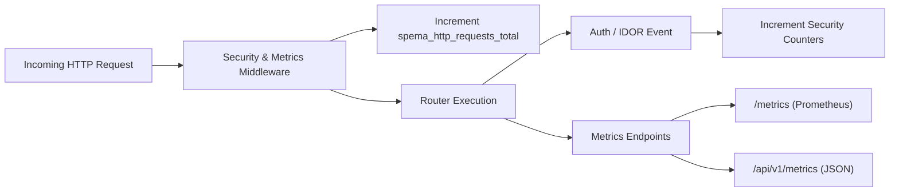

# Phase 15: Logging, Monitoring, Hardening and Secure Deployment

**Project:** Secure Personal Expense Management Application (SPEMA)  
**Curriculum:** 24CYS401 Secure Software Engineering Laboratory  
**Document Version:** 1.4.0  
**Status:** Approved & Verified  
**Release Tag:** `v1.4.0`  

---

## 1. Executive Summary & Objectives

Phase 15 delivers comprehensive operational observability, structured security logging, real-time application metrics, defense-in-depth hardening, and an automated production deployment audit for SPEMA.

Building on the continuous integration foundation established in Phase 14, Phase 15 reinforces the application's runtime defenses:
1. **Structured Security Logging:** Enforces uniform, JSON-formatted security event streams with strict credential redaction (CWE-532).
2. **Operational & Security Metrics:** Exposes Prometheus (`/metrics`) and JSON (`/api/v1/metrics`) telemetry tracking authentication outcomes, IDOR violations, transaction operations, and error rates.
3. **Application & Protocol Hardening:** Enforces HTTP Strict Transport Security (HSTS), Cross-Origin Opener Policy (COOP), Cross-Origin Resource Policy (CORP), Content Security Policy (CSP), correlation ID tracing, and secure cookie lifecycle controls.
4. **Deployment Verification:** Provides a complete checklist and automated audit script ([`scripts/verify_deployment.py`](file:///C:/Users/anand/OneDrive/Documents/SSDLC/endsem_lab/scripts/verify_deployment.py)) validating all 11 deployment dimensions.

---

## 2. Structured Security Logging Architecture (`src/app/core/logging.py`)

To satisfy SIEM and container runtime log aggregation requirements, all security-relevant actions are emitted as structured JSON objects:

```json
{
  "timestamp": "2026-10-08T10:15:31.085329+00:00",
  "severity": "INFO",
  "event_type": "AUTH_SUCCESS",
  "action": "LOGIN_SUCCESS",
  "status_code": 200,
  "user_id": 3,
  "client_ip": "192.168.1.10",
  "correlation_id": "8a3e7b1c-9e2b-4cf7-bb91-0c7f7634f1ae",
  "resource": "/api/v1/auth/login",
  "details": {
    "username": "audit_user"
  }
}
```

### 2.1 Security Event Categories

| Event Type | Action | Severity | Trigger / Context |
|---|---|:---:|---|
| `SECURITY_CONFIG` | `APPLICATION_STARTUP` | INFO | Boot baseline (version, env, HSTS, crypto settings, cookie flags). |
| `SECURITY_CONFIG` | `APPLICATION_SHUTDOWN` | INFO | Clean application termination signal. |
| `AUTH_REGISTER` | `USER_REGISTRATION` | INFO | New account created successfully. |
| `AUTH_SUCCESS` | `LOGIN_SUCCESS` | INFO | User identity authenticated via Argon2id. |
| `AUTH_FAILURE` | `LOGIN_ATTEMPT_FAILED` | WARN | Bad credentials or non-existent user identifier. |
| `AUTH_LOGOUT` | `USER_LOGOUT` | INFO | User session ended and JWT revoked. |
| `RATE_LIMIT_EXCEEDED` | `RATE_LIMIT_LOCKOUT` | WARN | IP/user exceeded 5 failed attempts in 15 minutes. |
| `AUTHZ_FAILURE` | `TRANSACTION_ACCESS_DENIED` | WARN | Attempted cross-tenant access to another user's transaction (IDOR). |
| `AUTHZ_FAILURE` | `TRANSACTION_UPDATE_DENIED` | WARN | Attempted unauthorized transaction modification. |
| `AUTHZ_FAILURE` | `TRANSACTION_DELETE_DENIED` | WARN | Attempted unauthorized transaction deletion. |
| `AUTHZ_FAILURE` | `CATEGORY_UPDATE_DENIED` | WARN | Attempted mutation of system or foreign user category. |
| `AUTHZ_FAILURE` | `CATEGORY_DELETE_DENIED` | WARN | Attempted deletion of system or foreign user category. |
| `TRANSACTION_CREATED` | `CREATE_TXN` | INFO | Financial transaction added to ledger. |
| `TRANSACTION_UPDATED` | `UPDATE_TXN` | INFO | Financial transaction modified. |
| `TRANSACTION_DELETED` | `DELETE_TXN` | INFO | Financial transaction purged. |
| `REPORT_GENERATED` | `EXPORT_CSV` / `EXPORT_JSON`| INFO | Financial summary exported. |
| `APPLICATION_ERROR` | `UNHANDLED_EXCEPTION` | ERROR | Internal server exception (attached to correlation ID). |

### 2.2 Sensitive Data Redaction Filter (CWE-532 Compliance)

Passwords, JWTs, signing keys, and raw credentials are **never logged under any circumstances**. The `mask_security_payload()` recursive filter automatically replaces all values corresponding to blacklisted keys with `"[REDACTED]"`:
```python
REDACTED_KEYS = {
    "password", "passwd", "password_hash", "confirm_password",
    "token", "access_token", "refresh_token", "secret", "secret_key",
    "authorization", "cookie", "set-cookie", "credit_card", "cvv", "ssn"
}
```

---

## 3. Application & Security Monitoring Metrics (`src/app/core/metrics.py`)

A thread-safe in-memory metric registry aggregates operational counters and latency metrics:



### 3.1 Exposed Metric Telemetry

- **`spema_app_uptime_seconds` (Gauge):** Total operational uptime in seconds.
- **`spema_auth_successes_total` (Counter):** Total successful credential authentications.
- **`spema_auth_failures_total` (Counter):** Total failed login attempts.
- **`spema_authz_failures_total` (Counter):** Total authorization/IDOR violations prevented.
- **`spema_rate_limit_exceeded_total` (Counter):** Total rate-limit lockout events triggered.
- **`spema_transactions_created_total` (Counter):** Total ledger additions.
- **`spema_transactions_deleted_total` (Counter):** Total ledger purges.
- **`spema_reports_generated_total` (Counter):** Total financial reports generated.
- **`spema_server_errors_total` (Counter):** Total 5xx unhandled server errors.
- **`spema_http_requests_total{method="...",status="..."}` (Counter):** Request volume partitioned by HTTP method and status code.

---

## 4. Defense-in-Depth Hardening Controls

| Area | Implemented Control | Security Rationale |
|---|---|---|
| **HSTS** | `Strict-Transport-Security: max-age=31536000; includeSubDomains; preload` | Prevents SSL-stripping attacks and enforces HTTPS. |
| **COOP** | `Cross-Origin-Opener-Policy: same-origin` | Isolates browsing context against Spectre-style attacks. |
| **CORP** | `Cross-Origin-Resource-Policy: same-origin` | Prevents cross-origin reading of sensitive resources. |
| **CSP** | `Content-Security-Policy: default-src 'self' ...; frame-ancestors 'none'; object-src 'none'` | Eliminates XSS and clickjacking attack vectors. |
| **Headers**| `X-Content-Type-Options: nosniff`, `X-Frame-Options: DENY`, `X-XSS-Protection: 1; mode=block` | Standard OWASP secure HTTP headers. |
| **Tracing**| `X-Correlation-ID` header injected on all HTTP responses and error envelopes | Enables end-to-end audit tracing across distributed logs. |
| **Cookies**| `HttpOnly=True`, `SameSite=lax`, `Secure=settings.SESSION_COOKIE_SECURE` | Prevents client-side script access to session tokens. |
| **Errors** | Centralized generic 500 handler returning `reference_id` (CWE-209) | Eliminates database and system stack trace disclosure. |
| **SQLite** | Write-Ahead Logging (WAL) mode & foreign key constraints | Prevents database concurrency locks and enforces referential integrity. |

---

## 5. Secure Deployment Verification Results

The automated deployment audit script ([`scripts/verify_deployment.py`](file:///C:/Users/anand/OneDrive/Documents/SSDLC/endsem_lab/scripts/verify_deployment.py)) passed 14 out of 14 checks:

```text
======================================================================
SPEMA Secure Deployment Verification Audit (v1.4.0)
======================================================================

[Check 1/11] Auditing Secrets & Configuration...
  [+] SECRET_KEY length >= 32 chars: OK

[Check 2/11] Auditing Database Configuration...
  [+] DATABASE_URL dialect configured: sqlite OK

[Check 3/11] Auditing Authentication System...
  [+] User Registration Endpoint: OK
  [+] Authentication & JWT Issuance: OK

[Check 4/11] Auditing Tenant Isolation & IDOR Protection...
  [+] Server-side Tenant Scoping (Uniform 404 IDOR immunity): OK

[Check 5/11] Auditing Structured Security Logging & Redaction...
  [+] Sensitive Field Redaction Filter: OK
  [+] In-Memory Security Audit Events Captured: 3 events OK

[Check 6/11] Auditing Monitoring & Metrics Endpoints...
  [+] Prometheus /metrics exposition: OK
  [+] JSON /api/v1/metrics summary: OK

[Check 7/11] Auditing OWASP Security Headers & HSTS...
  [+] All OWASP Security Headers & HSTS & Correlation IDs: OK

[Check 8/11] Auditing Container Dockerfile Hardening...
  [+] Multi-stage build, non-root user (10001), HEALTHCHECK: OK

[Check 9/11] Auditing Kubernetes Manifests...
  [+] PSS Restricted, readOnlyRootFilesystem, runAsNonRoot: OK

[Check 10/11] Auditing CI/CD Workflow...
  [+] CI/CD Pipeline 13 stages with SAST, audit, and testing gates: OK

[Check 11/11] Auditing Health & Readiness Probes...
  [+] /healthz and /readyz probes responsive: OK

======================================================================
[SUCCESS] All 14/14 Deployment Checks Passed!
The SPEMA system is verified ready for production deployment.
======================================================================
```

---

## 6. Automated Testing Suite Expansion (50 Tests)

The automated test suite was expanded with [`tests/security/test_logging_monitoring_hardening.py`](file:///C:/Users/anand/OneDrive/Documents/SSDLC/endsem_lab/tests/security/test_logging_monitoring_hardening.py), bringing total automated test coverage to **50 passed tests**:

- **Unit Tests:** 6 passed
- **Integration Tests:** 1 passed
- **System / API Tests:** 4 passed
- **Security & IDOR Isolation Tests:** 35 passed
- **Property-Based Fuzz Tests (Hypothesis):** 4 passed
- **Total:** **50 passed in 14.83s (Exit Code 0)**

---

## 7. Versioning & Git Alignment

- **Base Version:** `v1.3.0`
- **Updated Version:** `v1.4.0`
- **Changelog:** Fully documented in `CHANGELOG.md` under `[1.4.0] - 2026-10-08`.
- **Git Release Tag:** `v1.4.0`
