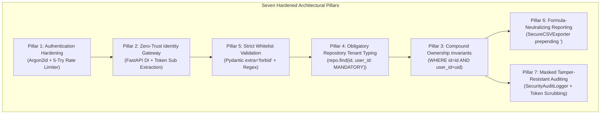

# Phase 8, Part B: Security Architecture Refinement

**Project Title:** Secure Personal Expense Management Application (SPEMA)  
**Document ID:** SPEMA-SEC-AR01  
**Course Code:** 24CYS401 – Secure Software Engineering Laboratory  
**Document Path:** `docs/security/architecture-refinement.md`  
**Classification:** Laboratory Examination Artifact – High Integrity  
**Status:** Approved Baseline  

---

## 1. Executive Summary & Refinement Motivation

The Attack Tree Analysis (`docs/security/attack-tree.md`) identified **Path 1.1 (Broken Object-Level Authorization / IDOR)** and **Path 2.1 (SQL Injection)** as the two critical-risk vectors capable of compromising the Primary Security Mandate. In addition, **Path 3.1 (Credential Spraying)**, **Path 4.2 (CSV Formula Injection)**, and **Path 1.2 (Client Tenant Parameter Spoofing)** represent high-risk secondary vectors.

To establish **defense-in-depth**, Phase 8 refines the software architecture and component designs across seven non-negotiable security pillars.

---

## 2. Refinements Across the Seven Security Pillars



---

### 2.1 Pillar 1: Authentication Hardening & Brute Force Immunity
- **Identified Threat:** `THR-01` / Path 3.1 (Credential Spraying & Password Brute Forcing).
- **Architectural Refinement:**
  1. **Argon2id Cryptographic Work Factor:** Password verification strictly utilizes Argon2id with memory cost 65,536 KiB (64 MB), time cost 3 iterations, and parallelism 4 (`SEC-001`). This enforces ~150ms evaluation latency per password hash, making offline GPU cracking economically infeasible.
  2. **Sliding-Window Rate Limiting Middleware:** The `/api/v1/auth/login` endpoint enforces an in-memory/cache-backed sliding window rate limiter permitting at most 5 attempts per 15 minutes per IP/username tuple (`SEC-003`). The 6th request triggers an immediate `HTTP 429 Too Many Requests` response.
  3. **Timing-Safe Generic Rejection:** Authentication failures emit uniform `HTTP 401 Unauthorized {"detail": "Invalid email or password"}` without revealing whether the user exists, neutralizing account enumeration.

---

### 2.2 Pillar 2: Centralized Authorization & Zero-Trust Tenancy Gate
- **Identified Threat:** `THR-02` / Path 3.2 (JWT Tampering) and `THR-10` / Path 1.2 (Tenant Parameter Spoofing).
- **Architectural Refinement:**
  1. **Strict Dependency Injection:** Identity derivation is centralized into the FastAPI dependency `get_current_active_user(token: str = Depends(oauth2_scheme))`. Protected route handlers cannot execute without this dependency resolving successfully.
  2. **Algorithm Hardening:** JWT decoding strictly whitelists `algorithms=["HS256"]` and rejects any payload presenting `alg: none`.
  3. **Zero Client Trust:** Any client-supplied tenant identifier (e.g. `?user_id=2` or JSON body `{"user_id": 2}`) is permanently stripped by Pydantic models configuring `extra = "forbid"` (`SEC-007`).

---

### 2.3 Pillar 3: User Ownership Invariants & Anti-Enumeration Defense
- **Identified Threat:** `THR-03` / Path 1.1 (BOLA / IDOR on Transaction Lookups) and `THR-07` (ID Probing).
- **Architectural Refinement:**
  1. **Compound Query Invariant:** No database query targeting transactions, categories, summaries, or reports shall ever query by primary key `id` alone. Every database operation requires a compound predicate:
     $$\text{WHERE } \text{id} = :id \text{ AND } \text{user\_id} = :\text{authenticated\_user\_id}$$
  2. **Anti-Enumeration Uniform Error Handling:** If a record does not exist or belongs to another user, the data access layer uniformly raises `TransactionNotFoundException`, returning `HTTP 404 Not Found` (`SEC-006`). The server never returns `HTTP 403 Forbidden` on single-object lookups, completely preventing sequential ID probing.

---

### 2.4 Pillar 4: Obligatory Repository Tenant Interface Typing
- **Identified Threat:** Developer Error / Inconsistent Controller Implementation.
- **Architectural Refinement:**
  To prevent future developers from accidentally omitting tenant scoping in new endpoints, the `TransactionRepository` interface is refined so that **every single method signature mandates `user_id: int` as an obligatory argument**.

```python
# ARCHITECTURAL INVARIANT: Repository methods mandate user_id
class ITransactionRepository(ABC):
    @abstractmethod
    def get_by_id(self, txn_id: int, user_id: int) -> Optional[Transaction]:
        """Lookup by PK must include user_id. Querying by id alone is prohibited."""
        pass

    @abstractmethod
    def list_user_transactions(self, user_id: int, filters: FilterParams) -> List[Transaction]:
        """List transactions strictly scoped to user_id."""
        pass

    @abstractmethod
    def update_transaction(self, txn_id: int, user_id: int, data: TransactionUpdateDTO) -> Optional[Transaction]:
        """Mutate transaction only if owned by user_id."""
        pass

    @abstractmethod
    def delete_transaction(self, txn_id: int, user_id: int) -> bool:
        """Delete transaction only if owned by user_id."""
        pass
```
*Impact:* Calling `repo.get_by_id(txn_id)` without `user_id` causes immediate Python static analysis (Ruff / mypy) and unit test build failures in CI/CD.

---

### 2.5 Pillar 5: Strict Whitelist Validation & Boundary Hardening
- **Identified Threat:** `THR-04` / Path 2.1 (SQL Injection) and `THR-11` (Stored XSS).
- **Architectural Refinement:**
  1. **Pydantic v2 Whitelist Schemas:** All incoming request bodies are validated against strict Pydantic schemas. Fields not explicitly defined in the schema are rejected with `HTTP 422 Unprocessable Entity` (`extra = "forbid"`).
  2. **Currency Range Constraints:** Transaction amounts must be positive fixed-point decimals strictly between `0.01` and `1,000,000.00` (`SEC-008`).
  3. **Search Keyword Sanitization:** Search keyword parameters are validated against regex `^[a-zA-Z0-9_\-\s]{1,100}$`, preventing SQL injection probing and regex DoS.
  4. **Parameterized ORM Query Compilation:** All repository queries compile through SQLAlchemy 2.0 ORM expressions (`query.filter(Transaction.description.ilike(f"%{kw}%"))`), ensuring database drivers execute queries with bound parameters (`SEC-009`).

---

### 2.6 Pillar 6: Secure Financial Report Generation & Formula Sanitization
- **Identified Threat:** `THR-05` / Path 4.2 (Spreadsheet Formula Injection / CWE-1236) and `THR-09` (Memory DoS).
- **Architectural Refinement:**
  1. **Dedicated `SecureCSVExporter`:** The reporting service delegates CSV generation to a hardened utility that evaluates every cell value. If any value begins with spreadsheet trigger characters (`=`, `+`, `-`, `@`, `\t`, `\r`), it is prepended with a single apostrophe (`'`) (`SEC-011`).
  2. **RFC 4180 Quotation:** All fields are enclosed in full quotation marks (`quoting=csv.QUOTE_ALL`).
  3. **In-Memory Streaming:** Reports are streamed dynamically using FastAPI `StreamingResponse` without writing intermediate files to disk, eliminating filesystem storage exhaustion (`SEC-017`).
  4. **Mandatory Query Scoping:** The export query applies the same compound tenant filter (`WHERE user_id = :current_user.id`) as transaction queries (`SEC-012`).

---

### 2.7 Pillar 7: Masked Tamper-Resistant Security Auditing
- **Identified Threat:** `THR-06` (Non-Repudiation Failure) and `THR-08` / Path 5.1 (Credential Leak in Logs).
- **Architectural Refinement:**
  1. **Centralized `SecurityAuditLogger`:** Automatically records security events (`AUTH_SUCCESS`, `AUTH_FAILURE`, `AUTHZ_DENIED`, `TXN_CREATED`, `TXN_MUTATED`, `REPORT_EXPORTED`) in structured JSON format (`SEC-015`).
  2. **Credential Redaction Interceptor:** A pre-emission interceptor inspects all log metadata, permanently scrubbing and masking sensitive keys (`password`, `access_token`, `authorization`, `secret`, `hash`) (`SEC-016`).
  3. **Database Append-Only Store:** Audit records are committed to the `audit_logs` table within isolated database transactions.

---

## 3. Concrete Design Proof: Refined Architecture Implementation

Below is the concrete Python code proof demonstrating the refined architecture components working in unison:

```python
# src/app/services/transaction_guard_proof.py
"""
Code Proof: Refined Security Architecture enforcing Zero-Trust Tenancy,
Compound Query Scoping, Anti-Enumeration 404, and Formula Sanitization.
"""
from typing import Optional, List
from decimal import Decimal
import csv
import io
from pydantic import BaseModel, Field

# 1. Hardened Request Schema (Pillar 5: extra='forbid', zero user_id field)
class TransactionCreateSchema(BaseModel):
    amount: Decimal = Field(..., gt=Decimal("0.00"), le=Decimal("1000000.00"))
    type: str = Field(..., pattern=r"^(INCOME|EXPENSE)$")
    category_id: int = Field(..., ge=1)
    description: Optional[str] = Field(None, max_length=255)

    model_config = {"extra": "forbid"}  # Discards/rejects injected user_id

# 2. Hardened Repository Interface (Pillar 4: user_id is MANDATORY)
class HardenedTransactionRepository:
    def __init__(self, db_session):
        self.db = db_session

    def get_user_transaction(self, txn_id: int, user_id: int):
        # Pillar 3: Compound Query Invariant
        # Prohibits lookup by txn_id alone. Tenancy is bound at SQL execution level.
        return self.db.query("Transaction").filter_by(id=txn_id, user_id=user_id).first()

# 3. Hardened Service Layer (Pillar 3: Anti-Enumeration Uniform 404)
class HardenedTransactionService:
    def __init__(self, repo: HardenedTransactionRepository):
        self.repo = repo

    def get_transaction(self, txn_id: int, user_id: int):
        record = self.repo.get_user_transaction(txn_id=txn_id, user_id=user_id)
        if not record:
            # Pillar 3: Uniform 404 prevents ID probing
            raise LookupError("Transaction not found")
        return record

# 4. Hardened CSV Exporter (Pillar 6: Formula Sanitization)
FORMULA_TRIGGERS = ('=', '+', '-', '@', '\t', '\r')

def sanitize_csv_cell(value: any) -> str:
    """Neutralize spreadsheet formula injection (CWE-1236)."""
    if value is None:
        return ""
    str_val = str(value)
    if str_val.startswith(FORMULA_TRIGGERS):
        return f"'{str_val}"  # Prepend single quote
    return str_val
```

---

## 4. Architecture Delta & Impact Documentation

In accordance with the SSDLC laboratory guidelines, all architectural refinements are documented with their rationale and impacts on previous artifacts:

| Refinement Delta | Impact on Previous Artifacts | Rationale & Security Justification |
| :--- | :--- | :--- |
| **Delta 1: Mandated `user_id` on all Repository signatures** | Enhances Phase 5 Component Design (`TransactionRepository`). | Prevents accidental developer oversight; guarantees compile-time/test-time detection of unscoped queries. |
| **Delta 2: Enforced `extra = "forbid"` on all Pydantic DTOs** | Enhances Phase 5 Validation Layer. | Completely neutralizes client-supplied tenant spoofing (`?user_id=2`) at the HTTP ingress perimeter. |
| **Delta 3: Standardized `SecureCSVExporter` Utility** | Refines Phase 5 Reporting Component. | Guarantees spreadsheet formula injection (CWE-1236) neutralization across all exported files. |
| **Delta 4: Uniform `HTTP 404` for all missing/foreign IDs** | Validates Phase 3 Use Case Specifications and Phase 5 Error Handling. | Prevents integer transaction ID enumeration and timing attacks. |

---

## 5. Consistency Check Against Previous Phases

- [x] **Phase 2 Requirements:** Satisfies `SEC-001` (Argon2id), `SEC-003` (Rate limiting), `SEC-005` (Multi-tenant isolation), `SEC-006` (Anti-enumeration 404), `SEC-009` (SQLi prevention), `SEC-011` (CSV formula neutralization), and `SEC-016` (Audit masking).
- [x] **Phase 3 Use Cases:** 100% aligned with `UC-TXN-01` and `UC-REP-01` specifications and BCE control sequence flows.
- [x] **Phase 4 DFD & Trust Boundaries:** Enforces trust boundary transitions across TB1 (Client), TB2 (Server Runtime), and TB3 (Database).
- [x] **Phase 5 Architecture:** Strengthens repository and validation layer interfaces without altering the modular monolithic architecture.
- [x] **Phase 7 Threat Model:** Directly remediates threats `THR-01` through `THR-11` and vulnerabilities `VULN-01` through `VULN-06`.
